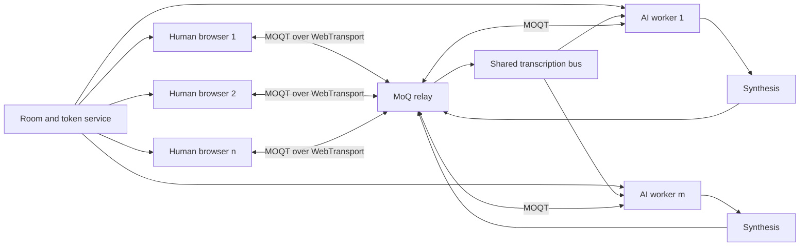
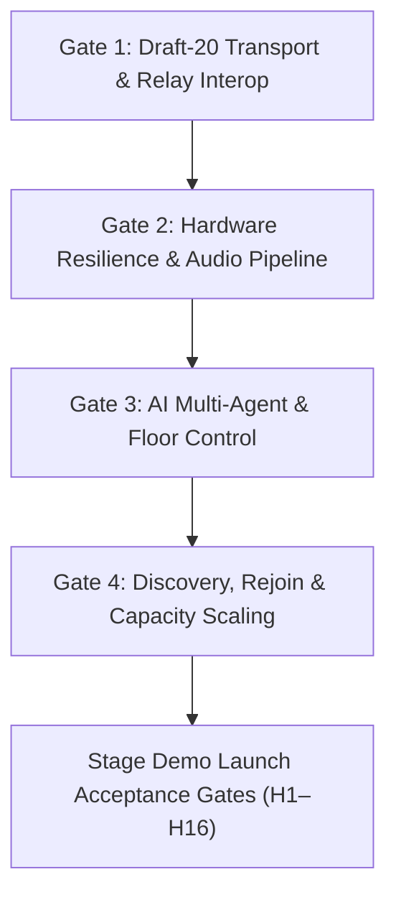

# Product specification: MoQ Multi-Party Audio Room — v1 demo

**Status:** Core implementation scaffold complete; live acceptance pending Gate 1
**Date:** 25 August 2026
**Implementation reconciliation:** 26 August 2026, current repository state
**Supersedes:** v1 demo scope of 25 August 2026 (three-way)
**Protocol target:** MOQT `draft-ietf-moq-transport-20`

### Change log

| Change | Effect |
|---|---|
| Draft pin remains `-20`; no operational downgrade | §2.1. Draft-specific code stays behind the adapter and live transport remains blocked until the target is trace-verified |
| Fixed three-participant room replaced by open membership | Any number of humans and AIs. §5 FR1, FR3, FR7. Capacity is measured and displayed, never configured as a cap |
| AI audio routing controls added | §5 FR8. Each human independently controls, per AI, whether that AI hears them and whether they hear it |
| Shared relay credential disclosure recorded as known P1 | §8.1 and Gate 1 now state the current Cloudflare V1 scope limitation, the absence of a compatible complete fix and the claims the demo must not make |

### Current implementation snapshot

This section records implementation state; it does not weaken the acceptance criteria below.

- React, TypeScript and Vite client surfaces, the SQLite Durable Object room service, control-plane WebSocket, presenter simulation, media pipeline, inspector, telemetry and failure registry are present.
- `moqtail` is exactly pinned at `0.12.1` and imported only by `MoqTransportAdapter`. A narrow pnpm patch passes its caught control-stream error into the existing termination callback instead of replacing it with an undefined reason.
- `wrangler.jsonc` pins the operational Cloudflare draft-16 endpoint and keeps `MOQT_TRANSPORT_VERIFIED` at `false`, `MOQ_ROUTING_ENFORCEMENT` at `cooperative` and `MOQ_DISCOVERY` at `unknown`. Unknown discovery is probed after live setup and the observed result is recorded in the inspector; it is not inferred from configuration.
- The adapter registry knows the supported draft metadata, while the pinned client frames draft 16 only and refuses any configured draft it cannot frame without downgrading.
- The `real-fabric-production` isolated relay is provisioned with upstream fallback disabled. The production Worker holds a seven-day, relay-scoped publish/subscribe token that expires at `2026-09-01T20:38:32Z`; relay acceptance and expiry behaviour remain unverified until a live browser trace runs.
- **Known P1 — shared relay credential disclosure:** unauthenticated room creation and open room joining return that configured token to the browser. It can be reused outside the room service for relay-wide publish and subscribe until expiry or revocation. Cloudflare's current V1 API can create unique, expiring and independently revocable tokens, but it constrains only relay-wide `publish` and `subscribe`; labels do not enforce room, namespace, track or participant scope, and each relay accepts at most ten registered tokens. No compatible complete fix is currently available from that API. The code remains unchanged pending an enforceable room-and-participant-scoped model that preserves H7 open membership.
- Presenter responses are scripted and visibly labelled. There is no live recognition, model, synthesis or AI-worker transport pipeline.
- `NetworkProbe` can compare the configured relay's WebTransport reachability with the room-service health gate. The live health endpoint confirms the relay and credential configuration, but no connected browser was available to run the UDP/HTTP-3 probe.
- Dynamic device tracking, packet-loss concealment, bounded recovery and silence-gated drift correction are implemented and unit-tested; they have not passed acoustic or live-relay acceptance.
- A bounded capture adapter retains `MediaStreamTrackProcessor` as the preferred Chrome path and adds an exact-frame AudioWorklet path for future desktop evaluation. Selection and framing are unit-tested; real-browser and acoustic parity remain open.
- Concurrent-room limits, relay credential rate-limiting and the per-room AI cost ceiling remain product requirements rather than implemented controls.
- Capture, relay-accepted publication and local subscription intent are separate states. Room membership completes before audio; **Start audio** and **Resume audio** initiate AudioContext activation, microphone capture and MOQT from the user action. `PUBLISH_OK` is required before the uplink or publish event appears; a rejected request stops capture and its exact sanitised refusal remains in same-tab session history.
- The automated suite contains 152 passing tests across ten files. The Objects and Latency tabs compare exposed session figures with specification-defined budgets or targets and identify diagnostic-only figures as `Reported · no gate`; acoustic loopback remains `Not exposed`. Gate 1 interoperability, physical-device Safari 27 acceptance, measured capacity, the audible ten-minute run and two clean venue-network script runs remain open.

---

## 0. What v1 is, and how to judge it

A presenter opens a link on stage. Humans and AI agents join freely. Every voice is an independent Media over QUIC track, and the audience watches objects fan out through a relay that mixes nothing and knows nothing about the conversation.

Open membership strengthens the central claim. A three-person room demonstrates publish/subscribe. A room where people and agents arrive and leave, and each client's uplink stays at one track regardless of how many are listening, demonstrates why the relay is the right place to put this.

v1 is a stage demo, not a service. Every requirement is judged against one question: **does it survive a conference network, one presenter and ten minutes of live use?**

### 0.1 Hard requirements

v1 has failed if any of these is untrue.

| ID | Requirement | Verified by |
|---|---|---|
| H1 | All live audio is MOQT objects over WebTransport / HTTP-3 / QUIC through a real MoQ relay. No fallback transport exists in the build. | Gate 1 trace, AC-2 |
| H2 | One independent track per participant, human or AI. No mixing at the relay or the room service, at any participant count. | AC-1, AC-3 |
| H3 | All supported browser, OS and major-version combinations are named in the README. Others show a "not the tested configuration" banner. | AC-11 |
| H4 | Headphones are required and stated before joining. Echo cancellation is a defence, not the mechanism. | Landing page, room banner |
| H5 | Each AI has its own address and speaks only when addressed. No AI volunteers into a conversation. | AC-5 |
| H6 | Barge-in silences the addressed AI within 300 ms of human onset, including objects already at the receiver. | AC-6, measured |
| H7 | **No participant cap.** Membership is open. Capacity is discovered by measurement, published in the README, and degraded visibly — never enforced as a configured limit. | §9.2, AC-12 |
| H8 | Any composition with at least one human is valid: one human alone, one human and six AIs, twelve humans and none. | AC-9 |
| H9 | **Per-AI audio routing.** Each human independently controls, for each AI, whether that AI receives their audio and whether they receive its audio. State is visible to its owner and honestly labelled as enforced or cooperative. | AC-7 |
| H10 | No AI subscribes to another AI's track by default. | AC-8 |
| H11 | Presenter mode runs the whole demo solo, including a configurable number of labelled simulated participants. | AC-10 |
| H12 | Reload within 60 seconds reclaims the same identity without duplicate playback. | AC-4 |
| H13 | Ten minutes of continuous audio at the reference composition (§9.1) with no audible drift artefact and no unbounded buffer growth. | Gate 2 exit |
| H14 | Every failure in §10 has a distinct, non-silent state. No silent fallback, ever. | AC-11 |
| H15 | Measurements the client cannot observe read **Not exposed**, never zero. | AC-13 |
| H16 | The demo script (§12) runs end to end, twice, clean, on the venue network or a hotspot. | Release gate |

**H7 does not remove limits on duration or cost.** Rooms hard-stop at 20 minutes, concurrent rooms are capped, and AI pipelines have a per-room cost ceiling. Those are operational controls on an unattended demo, not statements about how many voices the protocol carries.

### 0.2 Firm exclusions for v1

Video, screen share, recording, dial-in, moderation, accounts, captions, a WebRTC comparison, mobile outside the named foreground iPhone Safari candidate, end-to-end encryption opaque to the AIs, and any claim of MOQT interoperability or production readiness.

### 0.3 Deferred, to be built

| Item | Why not v1 |
|---|---|
| Captions and the `transcript/` track | Next task; it must include an explicit retention, privacy and screen-space design before implementation |
| Additional desktop browsers | H3 requires every capable combination to be tested and named; the current code recognises provisional Chrome 141+ on macOS only on desktop |
| General iOS and Android support | Top-level Safari 27+ on iPhone with iOS 27+ is a foreground-only provisional candidate. Other mobile configurations, continuous background audio and installed Home Screen mode remain outside this scope. |
| AI-to-AI conversation | Enabled by H10's default but deliberately off; see FR4 for the loop risk |
| Global mute — one participant silencing another for everyone | Needs an authority model the demo does not have. v1 routing is per-listener only |
| Viewer comprehension study | Needs a study design nobody runs before a conference deadline |

---

## 1. Product summary

Humans and AI agents hold a live audio conversation in a browser. Each voice is a distinct MoQ track. Browsers connect to a MoQ relay over WebTransport; each AI joins the same relay as another publisher and subscriber, indistinguishable to the relay from a human.

The demo is both a working conversation and an inspectable protocol artefact. A non-technical viewer joins and talks within 30 seconds. A technical viewer sees the publisher and subscriber graph, how objects move, how the graph changes as people join and leave, and how connection quality affects delivery.

This is an early-adopter demonstration. QUIC is a mature IETF standard. Browser WebTransport is broadly available but its W3C specification remains a Working Draft. MOQT remains an IETF Internet-Draft with breaking changes expected between versions.

## 2. What the demo proves

1. Browsers publish and subscribe to real-time audio through WebTransport over QUIC.
2. MoQ represents humans and AI processes with one publish/subscribe primitive, at arbitrary count and mixed composition.
3. A relay distributes independent tracks without becoming an application-specific mixer — and a publisher's uplink cost stays flat as the audience grows.
4. Routing is an application concern: who hears whom is a subscription decision, not a media-processing decision.

Point 4 is new, and it is what the AI routing controls in FR8 demonstrate. Muting an AI is not a filter applied to audio. It is a subscription that stops existing, visible as an edge disappearing from the inspector graph.

### 2.1 Draft pin:

**The current live-audio target is Cloudflare's operational `draft-ietf-moq-transport-16` relay.** All draft-specific behaviour stays strictly encapsulated behind `MoqTransportAdapter` in §6.4. Draft 20 remains the forward target when a compatible client and deployed endpoint are available; moving to it must not change room semantics, UI state or the audio pipeline.

As of 25 August 2026, the IETF datatracker publishes `draft-ietf-moq-transport-19`, while Cloudflare documents production relay support for drafts 14 and 16. The demo therefore uses draft 16 to establish the real transport boundary without claiming that this draft is the final protocol.

The current repository therefore behaves as follows:

1. Room membership, routing, presenter simulation, the frontend, media components, inspector, telemetry and automated tests continue independently of relay availability.
2. `MoqTransportAdapter.connect` attempts exactly the configured draft when the pinned client can frame it, and refuses any other draft without downgrading.
3. A configured endpoint and provisioned credential permit a real attempt; `MOQT_TRANSPORT_VERIFIED=false` prevents that attempt from being presented as accepted transport.
4. The configured draft-16 endpoint, client path and relay credential must pass a reproducible browser-to-relay trace before the verification flag can change.
5. Until that trace exists, the product makes no interoperability, latency, fan-out or live-audio claim.

## 3. User and value

**Primary user:** a technical decision-maker, architect, developer advocate or engineering team evaluating QUIC, WebTransport and MoQ.

**Need:** experience the technologies working together and see their maturity levels differ. Static diagrams do not convey latency, browser reach, relay fan-out behaviour, or how agents fit a topology built for media.

**Value:** an abstract stack becomes live and inspectable; what is deployable now is separated from what is draft-dependent; humans and AIs visibly share one distribution model; the audience sees fan-out cost land on the relay rather than the publisher; each run produces real latency and connection data.

**Route:** conference demos, architecture reviews, customer innovation sessions, developer education.

## 4. Experience

### 4.1 Entry

Landing page: **"People and AIs speaking over Media over QUIC."** Directly beneath it, **"Headphones required"** (H4).

The user enters a display name, may test the microphone, and chooses:

- **Create demo room** — receives a share link.
- **Join room** — joins via a valid link. No slot check; membership is open (H7).
- **Solo presenter mode** — one real human plus a configurable number of clearly labelled simulated participants and AIs (H11).

Pre-join checks cover secure context, `WebTransport`, WebCodecs Opus encode, microphone access and browser identity. Failures name the specific missing capability. The app never switches transport silently (H14).

**Pre-flight page.** A separate shareable URL runs the browser checks and reads the room-service health gate without joining. The direct relay reachability and UDP/HTTP-3 probe required for venue diagnosis remains a Gate 1 deliverable. Until it exists, a failed health request must not be described as proof that UDP is blocked. The documented network recovery is a phone hotspot, not a code path.

### 4.2 Room

**Layout scales with membership.** Below eight participants, equal cards. Above that, a compact grid ordered by recent speech, with the current and last three speakers held prominent so the view does not churn. Every participant is reachable regardless of count; no one is hidden behind a menu.

Each card shows role, mute and speaking state, connection state and live audio level. AI cards add **Listening**, **Thinking**, **Speaking**, **Interrupted**, **Not listening to you**, **Partial context** or **Unavailable**.

**Addressing an AI (H5).** Each AI has its own address — a hold-to-ask control on its card, or its configured wake name. The mechanism is chosen at Gate 2 from live comparison. Release of the control, or the end of the wake-name utterance, is a hard end-of-turn, which removes VAD endpointing latency from the response budget. An AI that is not addressed stays silent, no matter what it hears.

**AI audio routing (H9).** Every AI card carries two independent toggles, owned by the viewing human:

- **Hears me** — controls whether that AI subscribes to this human's track.
- **I hear it** — controls whether this human subscribes to that AI's track.

Both default per §8's consent rule. Turning off **Hears me** removes a real subscription; the inspector shows the edge disappear. Turning off **I hear it** is a local subscription change and affects nobody else. Neither is a filter over audio that still flows.

When an AI is not receiving every human in the room, its card reads **Partial context**, visible to everyone. Its answers are shaped by an incomplete picture and the room should be able to see that.

**Presenter health strip.** A compact status row shows transport state, participant count, subscription count, worst buffer depth, AI pipeline states and the last error. The current web implementation does not provide a technical screen-capture exclusion; the presenter must choose the captured surface accordingly.

### 4.3 Protocol inspector

Opens on:

```text
Microphone / AI voice
        ↓ Opus audio objects
Media over QUIC track
        ↓ WebTransport session (browsers)
HTTP/3 over QUIC
        ↓
MoQ relay
```

Detailed mode adds:

- Negotiated MOQT draft and relay endpoint.
- Session state, duration, reconnect count.
- **Live publisher/subscriber graph** for all tracks, updating as participants join, leave and change routing. This is the centrepiece at scale.
- **Uplink versus downlink**: one published track out, n−1 subscribed in. The asymmetry is the fan-out argument, shown rather than asserted.
- Object sequence, age, size, late-drop count, per track.
- Latency decomposed by stage, per §9.3.
- Capacity state: active decoders, aggregate buffer depth, degradation step if engaged.
- Browser-reported WebTransport statistics where exposed.
- Timestamped connect, publish, subscribe, unsubscribe, first-object, routing-change, barge-in, reconnect and close events.

Values the client cannot observe read **Not exposed** (H15).

### 4.4 Exit

Leaving closes local publications and subscriptions, stops capture and signals the room service, subject to the 60-second rejoin window. Relay-credential invalidation cannot be accepted until credential minting exists. When the last human leaves and the window elapses, the backend expires the room state. No audio is retained.

## 5. Functional requirements

### FR1 — Room lifecycle and membership

- Ephemeral rooms with non-guessable identifiers.
- **Open membership (H7).** Anyone with a valid link joins. No participant cap, no slot allocation, no queue, no demotion to observer.
- Any composition with at least one human is valid (H8). A room with humans and no AI works. A room with one human and several AIs works.
- **Identity retention:** on disconnect or reload, participant identity is held against a single-use rejoin token for 60 seconds (H12).
- Empty rooms expire within 15 minutes. **Any room hard-stops at 20 minutes.** Concurrent rooms capped. These are cost controls, not participant limits.

### FR2 — Capability and permissions

- Require HTTPS, `WebTransport` and WebCodecs Opus encode.
- Request microphone access automatically when room membership is established. Browser permission remains authoritative; denial enters the named listen-only state without affecting subscriptions or inspection.
- Distinguish, with different copy and recovery advice: unsupported browser, missing codec, denied permission, no input device, relay unreachable, UDP blocked, draft mismatch, discovery unavailable.
- Offer an optional microphone level test before joining; once joined, publication starts automatically.
- Serve the same checks standalone at the pre-flight URL.

### FR3 — Audio publication and playback

- Capture mono voice with echo cancellation, noise suppression and automatic gain where supported.
- Encode Opus at **32 kbit/s**, 20 ms frames, presenter-adjustable.
- **Enable Opus DTX.** A silent participant then costs almost nothing across the relay and at every subscriber. This is what makes open membership affordable, and it should be visible in the inspector's per-track object rate.
- One independent track per participant. **No mixing at the relay or room service (H2).**
- Draft-16 publication uses the relay-supported `PUBLISH` / `PUBLISH_OK` path directly. It does not gate `PUBLISH` behind the unsupported `PUBLISH_NAMESPACE` request.
- Every listener defaults to being interested in every other permitted real-party audio track. A room-scoped track pushed through `SUBSCRIBE_NAMESPACE` receives a real `PUBLISH_OK` and enters the ordinary player path; a self-track or explicit listening opt-out receives `UNINTERESTED`. FR8 and H10 remain the permission boundaries for AI routing.
- Subscriptions are the routing mechanism. No participant subscribes to itself.
- Every human defaults to subscribing to every other real human track and can locally unsubscribe or resubscribe from that participant's card. A track that is not published yet may return code 16 `Track not found`; retries use a capped exponential sequence, stop automatically, and restart immediately when a later MOQT namespace announcement says a publication exists.
- **Playback graph:** each subscribed track decodes into its own buffered source node; all are summed in a single `AudioWorklet` against one output clock. The worklet is the only place mixing happens, and it happens on the listener's machine.
- **Clock drift:** estimate per-track skew between each sender's media clock and the local `AudioContext` clock. Correct continuously by slow resampling, or by inserting and dropping frames at detected silence. Log corrections and surface them in the inspector. Cost scales with active speakers, not with membership, because DTX means silent tracks produce nothing to correct.
- Adaptive jitter buffer per track, nominal 60 ms, bounded 40–200 ms, adapting to observed inter-arrival jitter and underrun rate.
- Drop objects too late to be useful, count the drop, conceal with Opus PLC. Sustained loss produces comfort noise, not silence.
- Prevent duplicate playback after reconnect or reload using participant, group and object identifiers.
- **Degradation ladder (H7).** When the client cannot sustain the active load, degrade in this order, announcing each step in the UI: raise nominal buffer; release decoders for tracks silent beyond 30 seconds and rebuild on first object; unsubscribe from least-recently-active participants and display *"audio paused for N participants — capacity protection engaged"*. Until Gate 2 records reference-hardware measurements, synthetic load thresholds must not be described as measured capacity. Once that evidence exists, the status may say *"beyond measured capacity"* only when the measured boundary is actually crossed. Never degrade silently, and never refuse a join to avoid degrading.

### FR4 — AI participants

- Any number of AI participants, each a separate MoQ publisher with its own identity, address and lifecycle.
- Each AI subscribes to human tracks where routing permits (FR8), never to itself.
- **No AI subscribes to another AI's track by default (H10).** Enabling it is a presenter action, gated behind a hard cap on consecutive AI-to-AI turns and a visible turn counter. Two agents can talk to each other until the room is unusable and the cost ceiling is hit; the default must be off.
- **Addressing (H5):** an AI generates only in response to its own address. Ambient conversation produces no response.
- **Floor control:** an AI does not begin publishing while another AI is publishing. A second addressed AI shows **Thinking** and waits. Concurrent AI speech is a presenter-enabled option, off by default.
- **Shared transcription bus.** Recognition runs once per human track and fans out to every AI that is subscribed to it. Naive per-AI recognition costs *(AIs × humans)* streams; the bus costs *(humans)*. With several AIs in the room this is the difference between a demo and a bill.
- **Barge-in (H6):** on detected onset from any human that AI is subscribed to, cancel generation, close the current group, publish a cancellation marker; receivers discard undelivered objects from that group. Audible stop within 300 ms, measured and reported.
- Suspend an AI's responses while any human track it subscribes to is reconnecting; show **Thinking** paused rather than answering on partial audio.
- Report recognition, model and synthesis timings separately from transport timing, per AI.
- **Scripted demo mode:** presenter-controlled, clearly labelled fixed responses when a live pipeline is unavailable.

### FR5 — Reconnection

- Detect failed or closed WebTransport sessions.
- Retry with bounded exponential backoff and jitter.
- Obtain a fresh short-lived credential when required.
- Restore publications, subscriptions and the routing matrix idempotently, reusing the rejoin token.
- After 30 seconds, show a terminal error with a retry action.

### FR6 — Telemetry

- Correlation ID per room session and per participant.
- Record connection timing, first-audio timing, participant count over time, subscription count, object counts and sizes, bytes, late drops, buffer depth, drift correction, routing changes, barge-in latency, degradation steps, reconnects and errors.
- Never log raw audio, transcript content, credentials, display names or microphone device labels.
- Export a sanitised JSON session report.

### FR7 — Participant discovery

Open membership needs clients to learn about participants who arrive after them.

- **Preferred:** `SUBSCRIBE_NAMESPACE`, which requests every track announced under a namespace and covers tracks added later. This is precisely the primitive an open room needs, and using it keeps discovery inside MoQ where the demo's argument lives.
- **Verify at Gate 1.** Cloudflare's current draft-16 implementation documentation lists `SUBSCRIBE_NAMESPACE` as supported, but that does not establish support or semantics for the unavailable draft-20 target. Test it against the actual Gate 1 endpoint before treating discovery as negotiated.
- **Fallback:** the room service pushes a membership list over its existing control channel and clients subscribe per track. Correct and dull. If used, the inspector must say so rather than implying discovery came over MoQ.
- Either way, discovery is advisory. **Arrival of audio objects is the source of truth for "connected".** The UI never blocks on a membership list.

### FR8 — AI audio routing

The listener-owned matrix behind H9. For every (human, AI) pair, two independent booleans.

- **Inbound — "hears me".** Controls whether that AI subscribes to that human's track. Default follows the consent rule in §8: off until the human consents.
  - Enforce at the relay by scoping the AI's subscriber credential to permitted tracks, if the credential model allows it. **This is the strong form and is preferred.**
  - Where the relay cannot enforce it, the AI worker unsubscribes on request. **This is cooperative, not enforced**, and the UI must say which form is in effect rather than implying a guarantee the transport is not providing. Gate 1 determines which is achievable.
- **Outbound — "I hear it".** Controls whether that human subscribes to that AI's track. Purely local, needs no coordination, affects nobody else.
- Changes take effect within 500 ms and appear as subscribe/unsubscribe events in the inspector.
- Each human sees only their own row. An AI's **Partial context** badge is visible to everyone, without revealing who muted it.
- Routing state survives reconnection (FR5) and rejoin within the token window.
- Human-to-human routing is out of scope for v1. The mechanism generalises; the demo does not need it, and it opens a social-dynamics question a technical demo should not answer on stage.

## 6. Protocol and media design

### 6.1 Stack and maturity

| Layer | Role | Maturity |
|---|---|---|
| QUIC | Secure multiplexed transport beneath HTTP/3 | IETF Standards Track, RFC 9000, May 2021 |
| WebTransport | Browser session carrying MOQT | Broad modern-browser availability; W3C Working Draft |
| MOQT | Named tracks, objects, relay distribution | IETF Internet-Draft; targets unreleased at `-20`, subject to §2.1 |
| Demo audio format | Maps Opus frames to groups and objects | Application-specific; not an IETF media standard |

Browsers use MOQT over WebTransport. AI workers use raw QUIC or WebTransport, decided at Gate 1. All terminate at the same relay.

### 6.2 Tracks

Opaque identifiers only. No display names or personal data in relay-visible names.

```text
namespace: demo/<opaque-room-id>

tracks:
  audio/<participant-id>       Opus audio, one per participant of any kind
  presence/<participant-id>    join, mute, speaking, leave
```

Humans and AIs are indistinguishable at the relay. Role is application metadata carried on the presence track, not structure the relay can see — which is the point of the layering and worth saying aloud during the demo.

Each identity publishes only its allocated tracks. Subscription rights follow FR8.

**Presence is advisory.** Carrying it over MoQ shows the primitive generalising beyond media, but the UI never blocks on it. Audio object arrival is the source of truth for "connected"; presence updates the label afterwards.

### 6.3 Audio object mapping

- Codec: Opus, mono, 48 kHz media clock, 20 ms packetisation, DTX enabled.
- Group: one second of audio, giving frequent join and recovery points, and a natural barge-in cancellation unit.
- Object: one encoded frame plus a minimal demo-format header.
- Header: format version, participant-ID hash, media timestamp, frame duration, sequence, flags including end-of-turn and cancellation.
- Priority: current audio outranks old audio. Use supported `-20` priority and delivery mechanisms; independently discard stale objects at the receiver.
- Do not depend on optional draft features unless confirmed against the relay's feature matrix. `SUBSCRIBE_NAMESPACE` (FR7) is the one that matters most.
- **Measure per-object overhead at Gate 1**, and again at the reference composition. Inbound object rate is roughly *(active speakers × 50)* per second. DTX keeps that tied to who is talking rather than who is present, and the difference should be visible in the inspector.

Document the format and test vectors. A future IETF MoQ streaming format can replace this layer without changing room semantics.

### 6.4 Draft boundary

`MoqTransportAdapter` exposes only:

```text
connect(endpoint, credential, draft)
publish(track, object)
subscribe(track, startPosition)
subscribeNamespace(namespace)
unsubscribe(track)
sessionStats()
close(reason)
```

Only the adapter contains draft constants, message encoding or draft-specific state transitions. A negotiation mismatch reports the local draft, the remote endpoint and a remediation step. Given §2.1, this boundary is load-bearing rather than tidy: it is the mechanism for surviving a pin that has to move.

## 7. Architecture



**Web client:** UI at any participant count, inspector, presenter strip, capture, Opus encode and decode, mixing worklet and drift correction, routing matrix, MOQT over WebTransport, local metrics, degradation ladder.

**Room and token service:** ephemeral rooms, identity and rejoin tokens, relay provisioning, least-privilege credentials scoped per FR8, AI worker lifecycle, membership fallback for FR7, rate limits and cost ceilings. Not in the media path.

**Shared transcription bus:** subscribes once per human track, runs recognition, fans transcripts with speaker identity to every AI permitted to receive that human.

**AI workers:** one per AI participant. Addressing detection, model, synthesis, publication, barge-in cancellation, floor control.

**MoQ relay:** authenticates, routes named tracks, fans out objects. Runs no AI, mixes no audio, and does not know which participants are human.

## 8. Security, privacy and trust

### 8.1 Known P1 — shared relay credential disclosure

The current implementation does not meet the least-privilege credential requirements below. Both unauthenticated room creation and open joining return the configured `MOQ_RELAY_TOKEN` to the browser. Although the application keeps it out of share links, persistent storage, telemetry and logs, the credential itself authorises publish and subscribe across the entire configured relay. A caller can therefore reuse it outside the room service, cross room boundaries on the shared relay and ignore cooperative participant-routing conventions until expiry or revocation.

Cloudflare's current [MoQ token API](https://developers.cloudflare.com/api/resources/moq/subresources/relays/subresources/tokens/methods/create/) presents no compatible complete remediation. V1 token scope is one relay plus the coarse `publish` and `subscribe` operations; a label is not an enforced room, namespace, track or participant claim. The ten-token-per-relay registry limit also makes unique per-participant tokens incompatible with H7 open membership. Provisioning one relay per room would provide room isolation but would still not enforce participant namespace ownership.

This is a known unresolved P1, not an accepted production risk, transport acceptance evidence or permission to weaken the requirements below. Short expiry, rotation, unique coarse tokens, application-signed claims, labels and client-side checks are mitigations or conventions, not a complete fix. Until a relay validates room and participant scope without adding a participant cap, the demo must not claim tenant isolation, credential-enforced routing or production readiness, and the current path must not carry sensitive audio.

- Isolated relay per demo tenancy, or equivalent namespace isolation.
- Account API tokens stay server-side.
- Unique, short-lived, least-privilege participant credentials. **AI subscriber credentials are scoped to permitted human tracks where the relay supports it (FR8).**
- **Link separation:** the share link carries a room join code only. The relay credential is minted server-side at join and never appears in a shareable URL. Where a draft places a token in the URL path, treat that URL as a secret, exclude it from telemetry, keep expiries short.
- Do not persist raw audio. Transient buffers only.
- **Consent is per (human, AI) pair.** Consent is the initial state of the inbound routing matrix in FR8, not a separate mechanism. A human consents to each AI hearing them, and revokes by turning off **Hears me**. Adding an AI mid-session does not inherit consent from AIs already present. A human joining later grants nothing until they act.
- Label AI participants persistently and unmistakably. At scale in a grid, role must be legible at a glance.
- Rate-limit room creation, duration and token minting. Hard-stop AI workers with the room. Enforce a per-room AI cost ceiling — with several AIs and open membership this is the runaway risk.
- Redact credentials, transcript text and personal data from errors and exports.

Transport encryption protects each connection. The demo does not claim media is opaque to the relay or to authorised AI services.

## 9. Measures

### 9.1 Reference composition

Latency and stability targets are stated against **six humans and two AIs**, one region, wired or good wifi. Every reported figure states the composition it was measured at. Figures without a composition are meaningless once membership is open.

### 9.2 Capacity, measured not capped

H7 forbids a participant cap, which makes measured capacity a deliverable rather than an afterthought.

- Establish the participant count at which the pinned client first engages step one of the degradation ladder, then step three, on reference hardware.
- Publish both figures in the README as *measured capacity*, with hardware and network stated.
- Verify the ladder engages visibly and recovers when count drops.
- Confirm uplink stays flat as membership grows. This is the fan-out claim and it should appear in the inspector during the demo.

### 9.3 Latency budget

Same-region reference path, p50, per stream:

| Stage | Budget |
|---|---|
| Capture quantum and frame fill | 20 ms |
| Opus encode, including algorithmic delay | 15 ms |
| Send, relay, receive | 40 ms |
| Jitter buffer, nominal | 60 ms |
| Decode and mix | 15 ms |
| **Total** | **≈150 ms** |

Target: **p50 <250 ms, p95 <500 ms**, same-region, at the reference composition. Per-stream latency should be broadly independent of participant count — the relay absorbs fan-out. **Confirm that rather than assuming it**; if p95 climbs with membership, the cause is local mixing load, and the degradation ladder is the answer.

Cross-region adds roughly 60–120 ms and is reported, not gated.

### 9.4 Measurement method

Single-machine acoustic loopback. The publishing tab emits a click train; a subscribing tab's output is captured on the same audio interface; offset recovered by cross-correlation. One clock, no synchronisation problem, ten runs.

Every figure states browser, OS, region, relay endpoint, negotiated MOQT draft, composition and network conditions.

### 9.5 Reported, not gated

Session readiness, WebTransport-to-MOQT-ready duration, late-drop rate, drift correction rate, reconnect time, barge-in stop latency, routing-change latency, degradation engagement, and AI first-audio with recognition, model and synthesis separated per AI.

### 9.6 Release gate

The §12 script runs end to end, twice, without operator intervention, on the venue network or a hotspot (H16). This is the only pass/fail product measure for v1.

## 10. Failure states

Every failure condition encountered in Real Fabric has a distinct, truthful, non-silent state (H14). The application never falls back to WebRTC or WebSocket audio, never masks transport failure behind simulated behaviour, and never presents unobservable telemetry as zero (H15).

### 10.0 Failure state registry

| Code | Title | Severity | Blocks publication | User experience | Behaviour | Recovery action |
|---|---|---|:---:|---|---|---|
| `transport_unsupported` | WebTransport or Opus encode unsupported | `blocking` | Yes | This browser does not expose the capability named in the pre-flight panel, so there is no way to publish audio. | No join and no fallback. The build contains no WebRTC or WebSocket audio path. | Open the demo on the pinned browser and version named in the README. |
| `udp_blocked` | HTTP/3 or UDP blocked | `blocking` | Yes | The relay could not be reached over HTTP/3 and QUIC. The network is filtering UDP. | The partial session is closed. No transport substitution is attempted. | Retry once, then switch to a phone hotspot. The fallback is a network, not a code path. |
| `microphone_denied` | Microphone permission denied | `degraded` | Yes | Listening and inspection continue. Nothing is published from this browser. | Publication stays closed. Subscriptions and the inspector are unaffected. | Grant microphone access in the browser site settings, then use the in-room retry action. |
| `microphone_no_device` | No microphone input device | `degraded` | Yes | No capture device was found. Listening and inspection continue. | Publication stays closed. Subscriptions and the inspector are unaffected. | Connect a microphone or headset, then use the in-room retry action. |
| `draft_mismatch` | MOQT draft mismatch | `blocking` | Yes | The local draft and the relay's draft differ. Both versions are named in the error. | The session stops before publishing. The draft is never silently downgraded. | Point the build at a relay endpoint serving the pinned draft. |
| `draft_endpoint_missing` | No draft-20 relay endpoint | `blocking` | Yes | The pinned MOQT draft has no verified relay endpoint, so live audio cannot start. This is reported at startup, not at join. | Room membership, routing, inspection and presenter simulation stay available. The draft is never downgraded to reach a relay that exists. | Complete Gate 1 per §2.1. Presenter simulation demonstrates the room without claiming transport. |
| `namespace_discovery_unavailable` | `SUBSCRIBE_NAMESPACE` unavailable | `degraded` | No | Membership still works. The inspector states which discovery mechanism is in use. | Discovery falls back to the room service control channel. Audio object arrival remains the source of truth for connected. | None required. Record the endpoint's capability against Gate 1 output four. |
| `participant_disconnected` | Participant disconnected | `transient` | No | That participant shows Reconnecting, then Left. Everyone else is unaffected. | All other tracks continue. Any AI subscribed to the missing track suspends rather than answering on partial audio. | None required. The rejoin window is 60 seconds. |
| `reloading` | Reconnecting after reload | `transient` | No | A brief reconnecting state, then the same identity and routing. | The single-use rejoin token restores identity and the routing matrix within 60 seconds. Playback is deduplicated so nothing plays twice. | None required. |
| `ai_pipeline_failed` | AI pipeline unavailable | `degraded` | No | That AI shows Unavailable. Every other participant is unaffected. | The AI's publication closes. Human tracks and other AIs continue. | Use the presenter's scripted responses, which are labelled as scripted. |
| `ai_floor_contention` | AI floor contention | `transient` | No | The second addressed AI shows Thinking, then speaks. Speech never overlaps. | Floor control serialises AI publication. Concurrent AI speech is off by default. | None required. |
| `ai_loop_capped` | AI-to-AI turn cap reached | `degraded` | No | The turn counter is visible and the exchange stops at the cap. | AI-to-AI subscription is off by default and hard-capped when a presenter enables it. | Address an AI directly to resume, or disable AI-to-AI routing. |
| `relay_failed` | Relay session failed | `transient` | Yes | The room shows Reconnecting with a bounded retry and a visible attempt count. | Publications, subscriptions and the routing matrix are restored idempotently. A terminal error with a retry action appears after 30 seconds. | Wait for the bounded retry, then use the retry action if it becomes terminal. |
| `beyond_measured_capacity` | Capacity protection engaged | `degraded` | No | The engaged degradation step is named in the room without presenting synthetic thresholds as measured capacity. No join is ever refused. | The ladder raises the nominal buffer, releases decoders for long-silent tracks, then unsubscribes the least recently active participants. | None required. The ladder recovers as the active speaker count drops. |
| `audio_behind` | Audio falling behind | `degraded` | No | A quality warning with the late-drop count for the affected track. | Stale objects are dropped and counted, loss is concealed with Opus packet loss concealment, and latency stays bounded. | None required. Sustained loss produces comfort noise rather than silence. |
| `drift_uncorrectable` | Clock drift beyond correction range | `degraded` | No | A quality warning on the affected track only. | That track's buffer is rebuilt at the next detected silence. | None required. |

---

### 10.1 Transport and protocol negotiation failure modes

1. **`transport_unsupported` (WebTransport or Opus encode unsupported)**
   - *Trigger:* Environment fails detection for `window.WebTransport` or `window.AudioEncoder` with Opus config (`audio/opus`).
   - *Severity:* `blocking` (blocks publication and live audio session).
   - *UX presentation:* Displays a dedicated blocking modal or pre-flight warning identifying the exact missing platform API.
   - *System behaviour:* Pre-flight validation stops the join sequence. No alternative transport (WebRTC, WebSocket, HTTP polling) is attempted.
   - *Recovery:* Open the application in Google Chrome 141+ on macOS (or the documented pinned configuration).

2. **`udp_blocked` (HTTP/3 or UDP blocked)**
   - *Trigger:* The initial WebTransport handshake to the relay fails or times out due to enterprise network firewalls filtering UDP traffic.
   - *Severity:* `blocking` (blocks publication and live relay streaming).
   - *UX presentation:* Failure banner stating *"The relay could not be reached over HTTP/3 and QUIC. The network is filtering UDP."*
   - *System behaviour:* The half-open session is terminated cleanly. No silent TCP/WebSocket fallback occurs.
   - *Recovery:* Retry once; if persistent, switch network uplink to a mobile phone Wi-Fi hotspot.

3. **`draft_mismatch` (MOQT draft mismatch)**
   - *Trigger:* The relay responds with a draft identifier differing from the local `MoqTransportAdapter` pin during session setup negotiation.
   - *Severity:* `blocking` (blocks session establishment).
   - *UX presentation:* Error banner explicitly naming both the client's local draft and the relay's returned draft.
   - *System behaviour:* Handshake aborts prior to any track publication. The draft is never silently downgraded.
   - *Recovery:* Align the deployed relay endpoint configuration with the adapter's pinned operational draft.

4. **`draft_endpoint_missing` (No verified draft-20 relay endpoint)**
   - *Trigger:* The room snapshot marks draft-20 transport unavailable or the room service returns no relay credential because `MOQT_TRANSPORT_VERIFIED` is false.
   - *Severity:* `blocking` (blocks live transport only; room service and presenter simulation remain functional).
   - *UX presentation:* Diagnostic banner reading *"The target MOQT draft has no deployed relay endpoint, so live audio cannot start."*
   - *System behaviour:* Room membership, control-plane presence, and presenter simulation continue operating. Live audio publication remains disarmed.
   - *Recovery:* Complete the draft-20 endpoint, client and credential proof in Gate 1. Do not configure an earlier draft as a live-audio fallback.

5. **`relay_failed` (Relay session failed)**
   - *Trigger:* An active WebTransport session to the MoQ relay drops abruptly due to socket closure or network transient.
   - *Severity:* `transient` (escalates to `blocking` after 30 seconds).
   - *UX presentation:* Status indicator transitions to amber *"Reconnecting (attempt N)..."*, displaying live attempt counts.
   - *System behaviour:* `ReconnectionPolicy` executes bounded exponential backoff with full jitter. If unrecovered after 30 seconds, enters terminal failure with an explicit user retry button.
   - *Recovery:* Wait for automatic backoff restoration; click manual retry if the session reaches terminal state.

---

### 10.2 Client audio hardware and permission failure modes

1. **`microphone_denied` (Microphone permission denied)**
   - *Trigger:* `navigator.mediaDevices.getUserMedia` rejects with `NotAllowedError` or `PermissionDeniedError`.
   - *Severity:* `degraded` (blocks publication; subscriptions and inspection remain active).
   - *UX presentation:* Non-blocking warning banner: *"Listening and inspection continue. Nothing is published from this browser."*
   - *System behaviour:* Capture graph is not initialized. Outbound audio track is not announced. Downlink subscriptions, AudioWorklet mixer, and protocol inspector operate normally.
   - *Recovery:* Grant microphone permissions in browser site settings and use the in-room retry action.

2. **`microphone_no_device` (No microphone input device)**
   - *Trigger:* `getUserMedia` rejects with `NotFoundError` or `DevicesNotFoundError`, or `enumerateDevices` returns zero audio input hardware.
   - *Severity:* `degraded` (blocks publication; downlink unaffected).
   - *UX presentation:* Informational banner: *"No capture device was found. Listening and inspection continue."*
   - *System behaviour:* Client operates in listen-only subscriber mode without throwing fatal exceptions.
   - *Recovery:* Connect a physical microphone or USB/Bluetooth headset and use the in-room retry action.

---

### 10.3 Discovery, membership and session lifecycle failure modes

1. **`namespace_discovery_unavailable` (`SUBSCRIBE_NAMESPACE` unavailable)**
   - *Trigger:* Relay rejects or does not support the MOQT `SUBSCRIBE_NAMESPACE` command (e.g. return code `UNSUPPORTED`).
   - *Severity:* `degraded` (non-blocking for room functionality).
   - *UX presentation:* Inspector explicitly displays discovery mode: *"Discovery: Room Service (Control Plane)"*.
   - *System behaviour:* Automatic fallback to Durable Object WebSocket control-plane track announcements. Track arrivals are individually subscribed via `SUBSCRIBE`. Audio object arrival remains the true authority for participant connection.
   - *Recovery:* None required. Operational telemetry records endpoint capability.

2. **`participant_disconnected` (Participant disconnected)**
   - *Trigger:* A remote participant's WebTransport session closes or heartbeat times out.
   - *Severity:* `transient` (non-blocking).
   - *UX presentation:* Participant card transitions to amber *"Reconnecting"*, and removes card after 60-second grace window expires.
   - *System behaviour:* All other participants' audio continue uninterrupted. Subscribed AI agents temporarily pause generation rather than hallucinating over truncated audio.
   - *Recovery:* None required. The remote participant has 60 seconds to reclaim session state.

3. **`reloading` (Reconnecting after reload)**
   - *Trigger:* User refreshes the browser tab or navigates away and returns within 60 seconds.
   - *Severity:* `transient` (non-blocking).
   - *UX presentation:* Brief *"Reconnecting"* badge, smoothly restoring display name, track associations, and routing toggles.
   - *System behaviour:* Single-use cryptographic rejoin token reclaims identity from Durable Object SQLite storage. `PlaybackDeduplicator` discards previously played audio objects to prevent acoustic doubling.
   - *Recovery:* None required.

---

### 10.4 AI pipeline, floor contention and loop failure modes

1. **`ai_pipeline_failed` (AI pipeline unavailable)**
   - *Trigger:* Upstream AI inference, speech-to-text bus, or text-to-speech engine returns 5xx error or connection timeout.
   - *Severity:* `degraded` (non-blocking for humans and other AIs).
   - *UX presentation:* Affected AI card displays red *"Unavailable"* badge.
   - *System behaviour:* Closes that AI's publication track. Human conversation and remaining AIs continue unaffected.
   - *Recovery:* Enable presenter scripted mode to provide verified deterministic responses for demonstration.

2. **`ai_floor_contention` (AI floor contention)**
   - *Trigger:* Multiple AI agents are addressed in rapid succession or simultaneously while an AI is already speaking.
   - *Severity:* `transient` (non-blocking).
   - *UX presentation:* Second AI transitions to *"Thinking (Queued)"* and waits for floor release.
   - *System behaviour:* `AiDirector` serialises publications. The queued AI begins transmitting only after the active AI finishes or is barged into.
   - *Recovery:* None required. Floor control resolves ordering automatically.

3. **`ai_loop_capped` (AI-to-AI turn cap reached)**
   - *Trigger:* Consecutive AI-to-AI conversation turns reach `AI_TO_AI_TURN_CAP` (currently six turns).
   - *Severity:* `degraded` (non-blocking).
   - *UX presentation:* AI card displays *"Turn cap reached"* with visible turn counter.
   - *System behaviour:* `AiDirector` blocks further AI-triggered addresses. Human speech immediately resets the turn counter to 0.
   - *Recovery:* Speak to address an AI directly, or disable AI-to-AI routing.

---

### 10.5 Media playout, clock drift and capacity degradation failure modes

1. **`beyond_measured_capacity` (Capacity protection engaged)**
   - *Trigger:* Local CPU/decoding load exceeds capacity thresholds (active speaker count, jitter buffer underruns).
   - *Severity:* `degraded` (non-blocking; joins are never refused).
   - *UX presentation:* Prominent status notification: *"audio paused for N participants — capacity protection engaged"*. Before Gate 2 records a reference result, synthetic strain triggers are never labelled as measured capacity.
   - *System behaviour:* Executes 3-tier degradation ladder: (1) raises nominal buffer to 120 ms, (2) releases decoders for tracks silent > 30 s, (3) unsubscribes least recently active speakers.
   - *Recovery:* None required. Restores subscriptions automatically as active speaker load subsides.

2. **`audio_behind` (Audio falling behind)**
   - *Trigger:* Subscribed audio objects arrive beyond the 200 ms maximum buffer threshold.
   - *Severity:* `degraded` (non-blocking).
   - *UX presentation:* Track telemetry highlights late-drop count in amber within the inspector.
   - *System behaviour:* Late objects are dropped and counted. Opus Packet Loss Concealment (PLC) synthesises missing frames to preserve pitch continuity; sustained loss emits comfort noise.
   - *Recovery:* None required. Latency remains bounded.

3. **`drift_uncorrectable` (Clock drift beyond correction range)**
   - *Trigger:* Sender media clock skew relative to the local output clock falls outside the implemented 0.98–1.02 correction ratio.
   - *Severity:* `degraded` (non-blocking).
   - *UX presentation:* Quality warning badge on affected participant track in inspector.
   - *System behaviour:* Resets and rebuilds that specific track's adaptive jitter buffer at the next detected speech pause (silence interval), preventing audible glitches.
   - *Recovery:* None required.

---

### 10.6 Protocol invariants and privacy rules

- **No Silent Fallback (H14):** A failure state never triggers an undercover transport fallback (e.g. WebRTC peer connection or WebSocket stream).
- **Truthful Telemetry (H15):** If a metric is unexposed by the browser (such as WebTransport RTT or packet loss on certain platforms), it must display **Not exposed**, never `0` or estimated figures.
- **Privacy Sanitisation (AC-14):** Failure telemetry, error logs, and export dumps must completely redact tokens, display names, raw audio payloads, transcripts, and hardware device labels.

---

## 11. Delivery gates and current status

The build proceeds around the external draft-20 dependency without changing the live-audio protocol claim. Earlier-draft relays may inform research, but they are not an operational fallback and cannot satisfy Gate 1. Each gate distinguishes code present in the repository from evidence collected at the real browser, relay, audio and venue boundaries.



---

### 11.1 Operating rule and status

1. **Protocol decoupling:** Keep protocol-library imports and draft-sensitive compatibility work strictly within `MoqTransportAdapter`.
2. **No operational downgrade:** Only a draft-20 browser-to-relay trace can enable live audio or satisfy Gate 1.
3. **Independent progress:** Continue frontend, room service, presenter simulation, media components, inspector, telemetry and tests while transport is unavailable.
4. **Truthful gates:** A unit test proves code behaviour, not relay interoperability, audible quality, capacity or venue readiness.

---

### 11.2 Gate 1: Live transport unblocking and relay interoperability

*Primary focus: establish verified browser-to-relay MOQT draft-20 transport, unblock live audio and eliminate transport failure modes.*

- **Addressed failure modes:** `draft_endpoint_missing`, `draft_mismatch`, `transport_unsupported`, `udp_blocked`, `relay_failed`.
- **Key deliverables:**
  1. **Draft-20 endpoint and adapter compatibility:** obtain a real endpoint and update only `MoqTransportAdapter` for the compatible draft-20 client/library surface.
  2. **Least-privilege credentials:** replace the shared browser credential with server-issued grants whose room, participant, operations and expiry are enforced by the relay. This deliverable is blocked on a compatible credential model: Cloudflare V1 exposes only relay-wide `publish`/`subscribe` scope and a ten-token registry, so per-client coarse tokens or labels must not be accepted as completion.
  3. **Negotiation evidence:** expose the negotiated draft and redacted endpoint and capture a reproducible trace.
  4. **Pre-flight network probe:** implement an active UDP/HTTP-3 reachability test; the current page checks `/api/health` only.
  5. **Bounded recovery:** verify the implemented `ReconnectionPolicy` and idempotent restoration against the live relay.
- **Exit criteria (Gate 1):**
  - Live browser publisher and subscriber exchange synthetic Opus frames across the selected draft-20 relay.
  - Reproducible trace captures MOQT objects over WebTransport, HTTP/3, and QUIC.
  - `MOQT_TRANSPORT_VERIFIED` set to `true`.

---

### 11.3 Gate 2: Hardware resilience and audio pipeline hardening

*Primary focus: Robust audio capture, browser hardware adaptability, jitter management, and drift correction.*

- **Addressed failure modes:** `microphone_denied`, `microphone_no_device`, `audio_behind`, `drift_uncorrectable`.
- **Key deliverables:**
  1. **Implemented and unit-tested:** listen-only failure states, mono capture constraints, Opus configuration, DTX capability reporting, bounded 40–200 ms jitter buffering, late drops, drift estimation and one listener-side mixing worklet.
  2. **Still required:** hot-plug device handling, explicit packet-loss concealment/comfort-noise verification, and browser-level teardown checks.
  3. **Acceptance evidence:** acoustic loopback latency, ten-minute audible stability, reference-hardware capacity and the supported-browser matrix.
- **Exit criteria (Gate 2):**
  - Continuous 10-minute audio playback at reference composition (6 humans + 2 AIs) with no audible drift artefacts and no unbounded buffer growth (H13).
  - Single-machine acoustic loopback confirms p50 latency < 250 ms and p95 < 500 ms (§9.3).

---

### 11.4 Gate 3: Multi-agent AI orchestration, floor control and fault isolation

*Primary focus: Autonomous AI participants, deterministic addressing, barge-in cancellation, and loop protection.*

- **Addressed failure modes:** `ai_pipeline_failed`, `ai_floor_contention`, `ai_loop_capped`.
- **Key deliverables:**
  1. **Implemented and unit-tested:** labelled scripted responses, `AiDirector` addressing and floor queue, unavailable state, six-turn AI-to-AI cap, receiver queue purging and routing-state changes.
  2. **Still required:** live recognition/model/synthesis workers, provider retention and cost controls, wake-name detection if selected, publisher emission of cancellation markers and end-to-end fault isolation.
  3. **Acceptance evidence:** two live AIs, ten addressed exchanges, audible barge-in within 300 ms and live routing changes within 500 ms.
- **Exit criteria (Gate 3):**
  - Two distinct AI agents respond exclusively to their respective wake names/addresses.
  - Barge-in halts AI playback audibly within 300 ms across 10 test interruptions.
  - Routing toggles (**Hears me** / **I hear it**) update subscription state within 500 ms and update the inspector live graph.

---

### 11.5 Gate 4: Hybrid discovery, rejoin and capacity scaling

*Primary focus: Scale open membership, guarantee robust page reload reclamation, and prevent performance collapse.*

- **Addressed failure modes:** `namespace_discovery_unavailable`, `participant_disconnected`, `reloading`, `beyond_measured_capacity`.
- **Key deliverables:**
  1. **Implemented and unit-tested:** control-channel discovery, attempted `SUBSCRIBE_NAMESPACE` when configured, SQLite room/routing state, 60-second rejoin, playback deduplication and the three-step degradation ladder:
     - *Step 1:* Expand nominal jitter buffer from 60 ms to 120 ms.
     - *Step 2:* Release decoders for tracks silent > 30 s.
     - *Step 3:* Unsubscribe least-recently-active participants and display banner *"audio paused for N participants — capacity protection engaged"* until a measured reference boundary exists.
- **Exit criteria (Gate 4 & Final Launch Gate):**
  - Every acceptance criterion in §13 passes.
  - The 3.5-minute demo script (§12) completes twice clean on a live network / mobile hotspot without operator intervention (H16).
  - Measured capacity figures documented in `README.md`.

---

## 12. Demo script

The real acceptance test. Three and a half minutes, in order.

| Time | Action | Must be visible |
|---|---|---|
| 0:00 | Presenter opens the room on the pinned browser | Ready within 5 s |
| 0:15 | Shares the link; several people join, or presenter mode adds simulated participants | Each arrival appears within 10 s; grid reflows without churn |
| 0:35 | Humans exchange a few sentences | One track per voice in the inspector; every AI silent (H5) |
| 1:00 | Presenter opens the subscription graph | Edges per participant; **one track out, n−1 in** — the fan-out argument, on screen |
| 1:20 | Presenter addresses one AI by name | Only that AI shows **Thinking**; first audio within 1.5 s; its track appears |
| 1:45 | Presenter interrupts mid-answer | Silent within 300 ms; state shows **Interrupted** |
| 2:00 | Presenter turns off **Hears me** for that AI, keeps talking, then asks it what was said | Subscription edge disappears; AI card reads **Partial context**; it cannot answer |
| 2:25 | Presenter addresses a second AI while the first is speaking | Floor control holds; second shows **Thinking**, then speaks; no overlap |
| 2:45 | A participant leaves; another joins | Graph updates live; nobody's audio interrupted |
| 3:00 | Presenter reloads the page | Identity and routing reclaimed; no duplicate playback |
| 3:15 | Presenter shows latency by stage and capacity state | Real figures, **Not exposed** where the browser gives nothing |
| 3:30 | Presenter leaves | Capture stops, sessions close, AI workers terminate, credentials expire |

## 13. Acceptance criteria

1. Multiple browsers hear each other through separately identifiable MoQ tracks, at every count tested.
2. A trace confirms WebTransport and HTTP/3 over QUIC — not WebSocket, not WebRTC — and no fallback path exists in the build.
3. The relay endpoint and negotiated draft are displayed and match the Gate 1 record.
4. Reload within 60 seconds reclaims identity and routing, restores correct subscriptions, and plays nothing twice.
5. Each AI responds only to its own address and stays silent through a human-to-human exchange.
6. Barge-in silences the addressed AI within 300 ms of human onset, including in-flight objects.
7. Turning off **Hears me** removes a real subscription within 500 ms, is visible in the inspector, marks the AI **Partial context**, and demonstrably changes what it can answer. Turning off **I hear it** affects only that listener.
8. No AI subscribes to another AI's track unless a presenter enables it, and enabled AI-to-AI exchange stops at the turn cap.
9. Rooms of one human, one human with several AIs, and several humans with no AI each work fully.
10. Presenter mode completes the §12 script solo with simulated participants.
11. Every failure mode in §10 produces a distinct state with its own recovery advice, truthful presentation, and no silent transport fallback.
12. Participant count is never rejected. Capacity is degraded visibly per the ladder, and measured figures appear in the README.
13. Unavailable measurements read **Not exposed** and never appear as measured values.
14. Exported telemetry contains no audio, transcript, token, display name or device label.
15. Closing stops capture, closes sessions, terminates all AI workers and expires credentials.

## 14. Open decisions

| Decision | Owner | Due | Status |
|---|---|---|---|
| Draft-20 relay endpoint and compatibility path | Architecture | Gate 1 | Open; no operational downgrade permitted |
| Browser MOQT client library | Client Lead | Gate 1 | `moqtail` `0.12.1` pinned behind the adapter; draft-20 interoperability unverified |
| `SUBSCRIBE_NAMESPACE` support on the draft-20 endpoint | Transport Lead | Gate 1 | Unknown. The configured draft-16 endpoint is now probed live rather than treating unknown configuration as a refusal. |
| Per-track credential scoping — FR8 enforced or cooperative | Security Lead | Gate 1 | Blocked by Cloudflare V1 relay-wide operation scope; current UI label remains cooperative |
| Relay credential acceptance, enforcement and expiry | Security Lead | Gate 1 | Known P1: create and join disclose the configured relay-wide token. No compatible room-and-participant-scoped fix is available from Cloudflare V1; code remains unchanged pending a capable credential model |
| AI worker transport: raw QUIC or WebTransport | AI Lead | Gate 1 | Open; no live AI worker exists |
| Recognition, model and synthesis providers; retention terms; per-room cost ceiling | Product Owner | Gate 2 start | Not implemented |
| Addressing mechanism: hold-to-ask or wake name | UX Lead | Gate 2 exit | Hold-to-ask is wired; wake names are stored but not detected |
| Supported browser, OS and major-version matrix | QA Lead | Gate 2 exit | Open; current implementation recognises provisional Chrome 141+ on macOS and top-level Safari 27+ on iPhone with iOS 27+, both pending applicable real-browser acceptance |
| Grid layout threshold and ordering rule | UX Lead | Gate 2 exit | Compact threshold = 8 |
| Reference network definition | QA Lead | Gate 2 exit | Open; wired or good Wi-Fi remains the provisional test condition |

## 15. Source basis

- [RFC 9000](https://www.rfc-editor.org/info/rfc9000/) — IETF Standards Track, May 2021.
- [W3C WebTransport Candidate Recommendation](https://www.w3.org/TR/webtransport/) — browser streams and datagrams API.
- [MDN WebTransport](https://developer.mozilla.org/en-US/docs/Web/API/WebTransport) — Baseline 2026, with older-device and subfeature caveats.
- [IETF MOQT draft](https://datatracker.ietf.org/doc/draft-ietf-moq-transport/) — datatracker at `-19` as checked on 25 August 2026; **`-20` is not yet published**. Not an RFC.
- [Cloudflare isolated relay API](https://blog.cloudflare.com/moq-relays/) — isolated relays and separate publisher/subscriber credentials; Cloudflare reports draft-16 production support, July 2026.
- [Cloudflare moq-rs](https://github.com/cloudflare/moq-rs) — the main branch targets draft 16 and currently lists `SUBSCRIBE_NAMESPACE` as supported; that does not prove draft-20 endpoint support.
- [MoQ ecosystem directory](https://moqtap.com/directory/) — implementations by draft version; useful for the Gate 1 client survey.
- [Cloudflare relay launch](https://blog.cloudflare.com/moq/) — launched across 330+ cities, August 2025.
- [Safari 26.4 release notes](https://developer.apple.com/documentation/safari-release-notes/safari-26_4-release-notes) — WebTransport added in Safari 26.4.
- [Safari 27 release notes](https://developer.apple.com/documentation/safari-release-notes/safari-27-release-notes) and [iOS 27 release notes](https://developer.apple.com/documentation/ios-ipados-release-notes/ios-ipados-27-release-notes) — the provisional physical-device candidate; beta status is not acceptance evidence.
- [WebKit bug 319818](https://bugs.webkit.org/show_bug.cgi?id=319818) — reported Safari WebTransport flow-control deadlock after 16 MB received or 7,600 streams; the iPhone soak must cross both thresholds without hanging.

**Recheck `-20` publication and relay deployment weekly until Gate 1 closes.** The pin is the project's largest external dependency, and its status is the one fact in this document most likely to change without notice.
