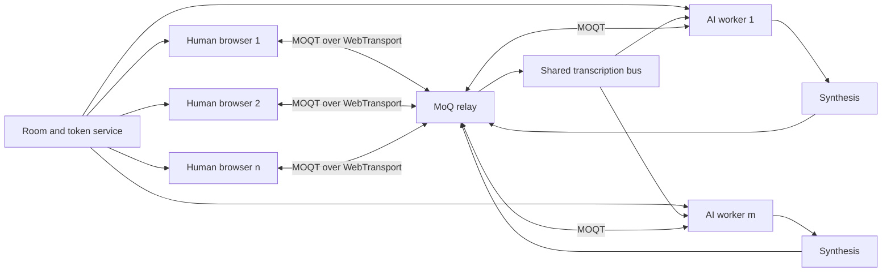

# Product specification: MoQ Multi-Party Audio Room — v1 demo

**Status:** Scoped for build, pending Gate 1
**Date:** 25 August 2026
**Supersedes:** v1 demo scope of 25 August 2026 (three-way)
**Protocol target:** MOQT `draft-ietf-moq-transport-20`

### Change log

| Change | Effect |
|---|---|
| Pin moved from `-16` to `-20` | §2.1. Introduces a hard external dependency; see the risk statement there |
| Fixed three-participant room replaced by open membership | Any number of humans and AIs. §5 FR1, FR3, FR7. Capacity is measured and displayed, never configured as a cap |
| AI audio routing controls added | §5 FR8. Each human independently controls, per AI, whether that AI hears them and whether they hear it |

---

## 0. What v1 is, and how to judge it

A presenter opens a link on stage. Humans and AI agents join freely. Every voice is an independent Media over QUIC track, and the audience watches objects fan out through a relay that mixes nothing and knows nothing about the conversation.

Open membership strengthens the central claim. A three-person room demonstrates publish/subscribe. A room where people and agents arrive and leave, and each client's uplink stays at one track regardless of how many are listening, demonstrates why the relay is the right place to put this.

v1 is a stage demo, not a service. Every requirement is judged against one question: **does it survive a conference network, one presenter and ten minutes of live use?**

### 0.1 Hard requirements

v1 has failed if any of these is untrue.

| ID | Requirement | Verified by |
|---|---|---|
| H1 | All live audio is MOQT objects over WebTransport / HTTP-3 / QUIC through a real MoQ relay. No fallback transport exists in the build. | Gate 1 trace, AC-2 |
| H2 | One independent track per participant, human or AI. No mixing at the relay or the room service, at any participant count. | AC-1, AC-3 |
| H3 | One pinned browser, OS and major version, named in the README. Others show a "not the tested configuration" banner. | AC-11 |
| H4 | Headphones are required and stated before joining. Echo cancellation is a defence, not the mechanism. | Landing page, room banner |
| H5 | Each AI has its own address and speaks only when addressed. No AI volunteers into a conversation. | AC-5 |
| H6 | Barge-in silences the addressed AI within 300 ms of human onset, including objects already at the receiver. | AC-6, measured |
| H7 | **No participant cap.** Membership is open. Capacity is discovered by measurement, published in the README, and degraded visibly — never enforced as a configured limit. | §9.2, AC-12 |
| H8 | Any composition with at least one human is valid: one human alone, one human and six AIs, twelve humans and none. | AC-9 |
| H9 | **Per-AI audio routing.** Each human independently controls, for each AI, whether that AI receives their audio and whether they receive its audio. State is visible to its owner and honestly labelled as enforced or cooperative. | AC-7 |
| H10 | No AI subscribes to another AI's track by default. | AC-8 |
| H11 | Presenter mode runs the whole demo solo, including a configurable number of labelled simulated participants. | AC-10 |
| H12 | Reload within 60 seconds reclaims the same identity without duplicate playback. | AC-4 |
| H13 | Ten minutes of continuous audio at the reference composition (§9.1) with no audible drift artefact and no unbounded buffer growth. | Gate 2 exit |
| H14 | Every failure in §10 has a distinct, non-silent state. No silent fallback, ever. | AC-11 |
| H15 | Measurements the client cannot observe read **Not exposed**, never zero. | AC-13 |
| H16 | The demo script (§12) runs end to end, twice, clean, on the venue network or a hotspot. | Release gate |

**H7 does not remove limits on duration or cost.** Rooms hard-stop at 20 minutes, concurrent rooms are capped, and AI pipelines have a per-room cost ceiling. Those are operational controls on an unattended demo, not statements about how many voices the protocol carries.

### 0.2 Firm exclusions for v1

Video, screen share, recording, dial-in, moderation, accounts, captions, a WebRTC comparison, mobile, end-to-end encryption opaque to the AIs, and any claim of MOQT interoperability or production readiness.

### 0.3 Deferred, with reasons

| Item | Why not v1 |
|---|---|
| Captions and the `transcript/` track | Privacy obligation out of proportion to demo value; competes with the inspector for screen space |
| Browsers beyond the pinned one | The binding constraint is WebTransport ∩ WebCodecs Opus ∩ AudioWorklet, not WebTransport alone |
| iOS and Android | Autoplay gating, route changes, background suspension |
| AI-to-AI conversation | Enabled by H10's default but deliberately off; see FR4 for the loop risk |
| Global mute — one participant silencing another for everyone | Needs an authority model the demo does not have. v1 routing is per-listener only |
| Viewer comprehension study | Needs a study design nobody runs before a conference deadline |

---

## 1. Product summary

Humans and AI agents hold a live audio conversation in a browser. Each voice is a distinct MoQ track. Browsers connect to a MoQ relay over WebTransport; each AI joins the same relay as another publisher and subscriber, indistinguishable to the relay from a human.

The demo is both a working conversation and an inspectable protocol artefact. A non-technical viewer joins and talks within 30 seconds. A technical viewer sees the publisher and subscriber graph, how objects move, how the graph changes as people join and leave, and how connection quality affects delivery.

This is an early-adopter demonstration. QUIC is a mature IETF standard. Browser WebTransport is broadly available but its W3C specification remains a Working Draft. MOQT remains an IETF Internet-Draft with breaking changes expected between versions.

## 2. What the demo proves

1. Browsers publish and subscribe to real-time audio through WebTransport over QUIC.
2. MoQ represents humans and AI processes with one publish/subscribe primitive, at arbitrary count and mixed composition.
3. A relay distributes independent tracks without becoming an application-specific mixer — and a publisher's uplink cost stays flat as the audience grows.
4. Routing is an application concern: who hears whom is a subscription decision, not a media-processing decision.

Point 4 is new, and it is what the AI routing controls in FR8 demonstrate. Muting an AI is not a filter applied to audio. It is a subscription that stops existing, visible as an edge disappearing from the inspector graph.

### 2.1 Draft pin: `-20`

**The pin is `draft-ietf-moq-transport-20`.** All draft-specific behaviour stays behind the adapter in §6.4.

The instruction to pin `-20` assumes the draft is stable through the build cycle. That assumption has two independent halves, and only one is about the IETF.

**Half one — does `-20` exist and hold still?** As of this date the working group draft is at `-18` on the datatracker, with `-19` reported current. `-20` is not yet published. Betting on its stability is a reasonable working-group judgement and is accepted here.

**Half two — will a relay speak it?** This is the half that stops the demo, and it is not under IETF control.

- Cloudflare's isolated relays — required by §8 — currently support `draft-14` and `draft-16` with authentication.
- The draft version is part of the endpoint hostname (`draft-16.cloudflare.mediaoverquic.com`). Draft support is a deployed endpoint, not a negotiated capability. A `draft-20` endpoint has to exist as infrastructure.
- Cloudflare's own MoQT implementation publishes support for `-04` to `-07`, `-14` and `-16`. Nothing above `-16`.
- `-18` has been an interop-test target. There is no public signal about `-20` deployment or its timing.

**Consequence.** Pinning `-20` converts the relay from a dependency that exists into one that has to arrive. It also shrinks the client library field: implementations advertising `-19` exist, but a `-20` client will likely mean forking or writing one.

**Resolution at Gate 1**, in preference order:

1. A `-20` Cloudflare endpoint is available. Proceed as specified.
2. No `-20` endpoint, but `-20` is published and library support exists. **Self-host `moq-relay` at `-20`.** The demo keeps its protocol claim and loses the "runs on a global CDN" claim. Adds relay operations to the build.
3. Neither. Escalate the pin decision with measured evidence. `-16` remains buildable today, and the adapter makes the eventual move a contained project.

Gate 1 records the draft actually negotiated against a real relay. That record, not this section, is what the inspector displays.

## 3. User and value

**Primary user:** a technical decision-maker, architect, developer advocate or engineering team evaluating QUIC, WebTransport and MoQ.

**Need:** experience the technologies working together and see their maturity levels differ. Static diagrams do not convey latency, browser reach, relay fan-out behaviour, or how agents fit a topology built for media.

**Value:** an abstract stack becomes live and inspectable; what is deployable now is separated from what is draft-dependent; humans and AIs visibly share one distribution model; the audience sees fan-out cost land on the relay rather than the publisher; each run produces real latency and connection data.

**Route:** conference demos, architecture reviews, customer innovation sessions, developer education.

## 4. Experience

### 4.1 Entry

Landing page: **"People and AIs speaking over Media over QUIC."** Directly beneath it, **"Headphones required"** (H4).

The user enters a display name, tests the microphone, and chooses:

- **Create demo room** — receives a share link.
- **Join room** — joins via a valid link. No slot check; membership is open (H7).
- **Solo presenter mode** — one real human plus a configurable number of clearly labelled simulated participants and AIs (H11).

Pre-join checks cover secure context, `WebTransport`, WebCodecs Opus encode, microphone access and browser identity. Failures name the specific missing capability. The app never switches transport silently (H14).

**Pre-flight page.** A separate shareable URL runs the same checks plus a relay reachability probe, without joining. Run it on the venue network before the talk. If HTTP-3 or UDP is blocked, the documented fallback is a phone hotspot, not a code path.

### 4.2 Room

**Layout scales with membership.** Below eight participants, equal cards. Above that, a compact grid ordered by recent speech, with the current and last three speakers held prominent so the view does not churn. Every participant is reachable regardless of count; no one is hidden behind a menu.

Each card shows role, mute and speaking state, connection state and live audio level. AI cards add **Listening**, **Thinking**, **Speaking**, **Interrupted**, **Not listening to you**, **Partial context** or **Unavailable**.

**Addressing an AI (H5).** Each AI has its own address — a hold-to-ask control on its card, or its configured wake name. The mechanism is chosen at Gate 2 from live comparison. Release of the control, or the end of the wake-name utterance, is a hard end-of-turn, which removes VAD endpointing latency from the response budget. An AI that is not addressed stays silent, no matter what it hears.

**AI audio routing (H9).** Every AI card carries two independent toggles, owned by the viewing human:

- **Hears me** — controls whether that AI subscribes to this human's track.
- **I hear it** — controls whether this human subscribes to that AI's track.

Both default per §8's consent rule. Turning off **Hears me** removes a real subscription; the inspector shows the edge disappear. Turning off **I hear it** is a local subscription change and affects nobody else. Neither is a filter over audio that still flows.

When an AI is not receiving every human in the room, its card reads **Partial context**, visible to everyone. Its answers are shaped by an incomplete picture and the room should be able to see that.

**Presenter health strip.** A compact status row visible to the presenter only, excluded from screen capture: transport state, participant count, subscription count, worst buffer depth, AI pipeline states, last error.

### 4.3 Protocol inspector

Opens on:

```text
Microphone / AI voice
        ↓ Opus audio objects
Media over QUIC track
        ↓ WebTransport session (browsers)
HTTP/3 over QUIC
        ↓
MoQ relay
```

Detailed mode adds:

- Negotiated MOQT draft and relay endpoint.
- Session state, duration, reconnect count.
- **Live publisher/subscriber graph** for all tracks, updating as participants join, leave and change routing. This is the centrepiece at scale.
- **Uplink versus downlink**: one published track out, n−1 subscribed in. The asymmetry is the fan-out argument, shown rather than asserted.
- Object sequence, age, size, late-drop count, per track.
- Latency decomposed by stage, per §9.3.
- Capacity state: active decoders, aggregate buffer depth, degradation step if engaged.
- Browser-reported WebTransport statistics where exposed.
- Timestamped connect, publish, subscribe, unsubscribe, first-object, routing-change, barge-in, reconnect and close events.

Values the client cannot observe read **Not exposed** (H15).

### 4.4 Exit

Leaving closes publications and subscriptions, stops capture and invalidates the credential, subject to the 60-second rejoin window. When the last human leaves and the window elapses, the backend ends all AI sessions and schedules room expiry. No audio is retained.

## 5. Functional requirements

### FR1 — Room lifecycle and membership

- Ephemeral rooms with non-guessable identifiers.
- **Open membership (H7).** Anyone with a valid link joins. No participant cap, no slot allocation, no queue, no demotion to observer.
- Any composition with at least one human is valid (H8). A room with humans and no AI works. A room with one human and several AIs works.
- **Identity retention:** on disconnect or reload, participant identity is held against a single-use rejoin token for 60 seconds (H12).
- Empty rooms expire within 15 minutes. **Any room hard-stops at 20 minutes.** Concurrent rooms capped. These are cost controls, not participant limits.

### FR2 — Capability and permissions

- Require HTTPS, `WebTransport` and WebCodecs Opus encode.
- Request microphone access only after an explicit user action.
- Distinguish, with different copy and recovery advice: unsupported browser, missing codec, denied permission, no input device, relay unreachable, UDP blocked, draft mismatch, discovery unavailable.
- Offer a microphone level test before publishing.
- Serve the same checks standalone at the pre-flight URL.

### FR3 — Audio publication and playback

- Capture mono voice with echo cancellation, noise suppression and automatic gain where supported.
- Encode Opus at **32 kbit/s**, 20 ms frames, presenter-adjustable.
- **Enable Opus DTX.** A silent participant then costs almost nothing across the relay and at every subscriber. This is what makes open membership affordable, and it should be visible in the inspector's per-track object rate.
- One independent track per participant. **No mixing at the relay or room service (H2).**
- Subscriptions are the routing mechanism. No participant subscribes to itself.
- **Playback graph:** each subscribed track decodes into its own buffered source node; all are summed in a single `AudioWorklet` against one output clock. The worklet is the only place mixing happens, and it happens on the listener's machine.
- **Clock drift:** estimate per-track skew between each sender's media clock and the local `AudioContext` clock. Correct continuously by slow resampling, or by inserting and dropping frames at detected silence. Log corrections and surface them in the inspector. Cost scales with active speakers, not with membership, because DTX means silent tracks produce nothing to correct.
- Adaptive jitter buffer per track, nominal 60 ms, bounded 40–200 ms, adapting to observed inter-arrival jitter and underrun rate.
- Drop objects too late to be useful, count the drop, conceal with Opus PLC. Sustained loss produces comfort noise, not silence.
- Prevent duplicate playback after reconnect or reload using participant, group and object identifiers.
- **Degradation ladder (H7).** When the client cannot sustain the active load, degrade in this order, announcing each step in the UI: raise nominal buffer; release decoders for tracks silent beyond 30 seconds and rebuild on first object; unsubscribe from least-recently-active participants and display *"audio paused for N participants — beyond measured capacity"*. Never degrade silently, and never refuse a join to avoid degrading.

### FR4 — AI participants

- Any number of AI participants, each a separate MoQ publisher with its own identity, address and lifecycle.
- Each AI subscribes to human tracks where routing permits (FR8), never to itself.
- **No AI subscribes to another AI's track by default (H10).** Enabling it is a presenter action, gated behind a hard cap on consecutive AI-to-AI turns and a visible turn counter. Two agents can talk to each other until the room is unusable and the cost ceiling is hit; the default must be off.
- **Addressing (H5):** an AI generates only in response to its own address. Ambient conversation produces no response.
- **Floor control:** an AI does not begin publishing while another AI is publishing. A second addressed AI shows **Thinking** and waits. Concurrent AI speech is a presenter-enabled option, off by default.
- **Shared transcription bus.** Recognition runs once per human track and fans out to every AI that is subscribed to it. Naive per-AI recognition costs *(AIs × humans)* streams; the bus costs *(humans)*. With several AIs in the room this is the difference between a demo and a bill.
- **Barge-in (H6):** on detected onset from any human that AI is subscribed to, cancel generation, close the current group, publish a cancellation marker; receivers discard undelivered objects from that group. Audible stop within 300 ms, measured and reported.
- Suspend an AI's responses while any human track it subscribes to is reconnecting; show **Thinking** paused rather than answering on partial audio.
- Report recognition, model and synthesis timings separately from transport timing, per AI.
- **Scripted demo mode:** presenter-controlled, clearly labelled fixed responses when a live pipeline is unavailable.

### FR5 — Reconnection

- Detect failed or closed WebTransport sessions.
- Retry with bounded exponential backoff and jitter.
- Obtain a fresh short-lived credential when required.
- Restore publications, subscriptions and the routing matrix idempotently, reusing the rejoin token.
- After 30 seconds, show a terminal error with a retry action.

### FR6 — Telemetry

- Correlation ID per room session and per participant.
- Record connection timing, first-audio timing, participant count over time, subscription count, object counts and sizes, bytes, late drops, buffer depth, drift correction, routing changes, barge-in latency, degradation steps, reconnects and errors.
- Never log raw audio, transcript content, credentials, display names or microphone device labels.
- Export a sanitised JSON session report.

### FR7 — Participant discovery

Open membership needs clients to learn about participants who arrive after them.

- **Preferred:** `SUBSCRIBE_NAMESPACE`, added in `draft-16`, which requests every track announced under a namespace and covers tracks added later. This is precisely the primitive an open room needs, and using it keeps discovery inside MoQ where the demo's argument lives.
- **Verify at Gate 1.** Cloudflare's published implementation notes have listed `SUBSCRIBE_NAMESPACE` as not yet supported. Announced in a draft is not the same as deployed on the endpoint. Test it against a real relay before designing around it.
- **Fallback:** the room service pushes a membership list over its existing control channel and clients subscribe per track. Correct and dull. If used, the inspector must say so rather than implying discovery came over MoQ.
- Either way, discovery is advisory. **Arrival of audio objects is the source of truth for "connected".** The UI never blocks on a membership list.

### FR8 — AI audio routing

The listener-owned matrix behind H9. For every (human, AI) pair, two independent booleans.

- **Inbound — "hears me".** Controls whether that AI subscribes to that human's track. Default follows the consent rule in §8: off until the human consents.
  - Enforce at the relay by scoping the AI's subscriber credential to permitted tracks, if the credential model allows it. **This is the strong form and is preferred.**
  - Where the relay cannot enforce it, the AI worker unsubscribes on request. **This is cooperative, not enforced**, and the UI must say which form is in effect rather than implying a guarantee the transport is not providing. Gate 1 determines which is achievable.
- **Outbound — "I hear it".** Controls whether that human subscribes to that AI's track. Purely local, needs no coordination, affects nobody else.
- Changes take effect within 500 ms and appear as subscribe/unsubscribe events in the inspector.
- Each human sees only their own row. An AI's **Partial context** badge is visible to everyone, without revealing who muted it.
- Routing state survives reconnection (FR5) and rejoin within the token window.
- Human-to-human routing is out of scope for v1. The mechanism generalises; the demo does not need it, and it opens a social-dynamics question a technical demo should not answer on stage.

## 6. Protocol and media design

### 6.1 Stack and maturity

| Layer | Role | Maturity |
|---|---|---|
| QUIC | Secure multiplexed transport beneath HTTP/3 | IETF Standards Track, RFC 9000, May 2021 |
| WebTransport | Browser session carrying MOQT | Broad modern-browser availability; W3C Working Draft |
| MOQT | Named tracks, objects, relay distribution | IETF Internet-Draft; pinned at `-20`, subject to §2.1 |
| Demo audio format | Maps Opus frames to groups and objects | Application-specific; not an IETF media standard |

Browsers use MOQT over WebTransport. AI workers use raw QUIC or WebTransport, decided at Gate 1. All terminate at the same relay.

### 6.2 Tracks

Opaque identifiers only. No display names or personal data in relay-visible names.

```text
namespace: demo/<opaque-room-id>

tracks:
  audio/<participant-id>       Opus audio, one per participant of any kind
  presence/<participant-id>    join, mute, speaking, leave
```

Humans and AIs are indistinguishable at the relay. Role is application metadata carried on the presence track, not structure the relay can see — which is the point of the layering and worth saying aloud during the demo.

Each identity publishes only its allocated tracks. Subscription rights follow FR8.

**Presence is advisory.** Carrying it over MoQ shows the primitive generalising beyond media, but the UI never blocks on it. Audio object arrival is the source of truth for "connected"; presence updates the label afterwards.

### 6.3 Audio object mapping

- Codec: Opus, mono, 48 kHz media clock, 20 ms packetisation, DTX enabled.
- Group: one second of audio, giving frequent join and recovery points, and a natural barge-in cancellation unit.
- Object: one encoded frame plus a minimal demo-format header.
- Header: format version, participant-ID hash, media timestamp, frame duration, sequence, flags including end-of-turn and cancellation.
- Priority: current audio outranks old audio. Use supported `-20` priority and delivery mechanisms; independently discard stale objects at the receiver.
- Do not depend on optional draft features unless confirmed against the relay's feature matrix. `SUBSCRIBE_NAMESPACE` (FR7) is the one that matters most.
- **Measure per-object overhead at Gate 1**, and again at the reference composition. Inbound object rate is roughly *(active speakers × 50)* per second. DTX keeps that tied to who is talking rather than who is present, and the difference should be visible in the inspector.

Document the format and test vectors. A future IETF MoQ streaming format can replace this layer without changing room semantics.

### 6.4 Draft boundary

`MoqTransportAdapter` exposes only:

```text
connect(endpoint, credential, draft)
publish(track, object)
subscribe(track, startPosition)
subscribeNamespace(namespace)
unsubscribe(track)
sessionStats()
close(reason)
```

Only the adapter contains draft constants, message encoding or draft-specific state transitions. A negotiation mismatch reports the local draft, the remote endpoint and a remediation step. Given §2.1, this boundary is load-bearing rather than tidy: it is the mechanism for surviving a pin that has to move.

## 7. Architecture



**Web client:** UI at any participant count, inspector, presenter strip, capture, Opus encode and decode, mixing worklet and drift correction, routing matrix, MOQT over WebTransport, local metrics, degradation ladder.

**Room and token service:** ephemeral rooms, identity and rejoin tokens, relay provisioning, least-privilege credentials scoped per FR8, AI worker lifecycle, membership fallback for FR7, rate limits and cost ceilings. Not in the media path.

**Shared transcription bus:** subscribes once per human track, runs recognition, fans transcripts with speaker identity to every AI permitted to receive that human.

**AI workers:** one per AI participant. Addressing detection, model, synthesis, publication, barge-in cancellation, floor control.

**MoQ relay:** authenticates, routes named tracks, fans out objects. Runs no AI, mixes no audio, and does not know which participants are human.

## 8. Security, privacy and trust

- Isolated relay per demo tenancy, or equivalent namespace isolation.
- Account API tokens stay server-side.
- Unique, short-lived, least-privilege participant credentials. **AI subscriber credentials are scoped to permitted human tracks where the relay supports it (FR8).**
- **Link separation:** the share link carries a room join code only. The relay credential is minted server-side at join and never appears in a shareable URL. Where a draft places a token in the URL path, treat that URL as a secret, exclude it from telemetry, keep expiries short.
- Do not persist raw audio. Transient buffers only.
- **Consent is per (human, AI) pair.** Consent is the initial state of the inbound routing matrix in FR8, not a separate mechanism. A human consents to each AI hearing them, and revokes by turning off **Hears me**. Adding an AI mid-session does not inherit consent from AIs already present. A human joining later grants nothing until they act.
- Label AI participants persistently and unmistakably. At scale in a grid, role must be legible at a glance.
- Rate-limit room creation, duration and token minting. Hard-stop AI workers with the room. Enforce a per-room AI cost ceiling — with several AIs and open membership this is the runaway risk.
- Redact credentials, transcript text and personal data from errors and exports.

Transport encryption protects each connection. The demo does not claim media is opaque to the relay or to authorised AI services.

## 9. Measures

### 9.1 Reference composition

Latency and stability targets are stated against **six humans and two AIs**, one region, wired or good wifi. Every reported figure states the composition it was measured at. Figures without a composition are meaningless once membership is open.

### 9.2 Capacity, measured not capped

H7 forbids a participant cap, which makes measured capacity a deliverable rather than an afterthought.

- Establish the participant count at which the pinned client first engages step one of the degradation ladder, then step three, on reference hardware.
- Publish both figures in the README as *measured capacity*, with hardware and network stated.
- Verify the ladder engages visibly and recovers when count drops.
- Confirm uplink stays flat as membership grows. This is the fan-out claim and it should appear in the inspector during the demo.

### 9.3 Latency budget

Same-region reference path, p50, per stream:

| Stage | Budget |
|---|---|
| Capture quantum and frame fill | 20 ms |
| Opus encode, including algorithmic delay | 15 ms |
| Send, relay, receive | 40 ms |
| Jitter buffer, nominal | 60 ms |
| Decode and mix | 15 ms |
| **Total** | **≈150 ms** |

Target: **p50 <250 ms, p95 <500 ms**, same-region, at the reference composition. Per-stream latency should be broadly independent of participant count — the relay absorbs fan-out. **Confirm that rather than assuming it**; if p95 climbs with membership, the cause is local mixing load, and the degradation ladder is the answer.

Cross-region adds roughly 60–120 ms and is reported, not gated.

### 9.4 Measurement method

Single-machine acoustic loopback. The publishing tab emits a click train; a subscribing tab's output is captured on the same audio interface; offset recovered by cross-correlation. One clock, no synchronisation problem, ten runs.

Every figure states browser, OS, region, relay endpoint, negotiated MOQT draft, composition and network conditions.

### 9.5 Reported, not gated

Session readiness, WebTransport-to-MOQT-ready duration, late-drop rate, drift correction rate, reconnect time, barge-in stop latency, routing-change latency, degradation engagement, and AI first-audio with recognition, model and synthesis separated per AI.

### 9.6 Release gate

The §12 script runs end to end, twice, without operator intervention, on the venue network or a hotspot (H16). This is the only pass/fail product measure for v1.

## 10. Failure states

| Failure | User experience | Behaviour |
|---|---|---|
| WebTransport or codec unsupported | Names the missing capability | No join, no fallback |
| HTTP/3 or UDP blocked | Relay error, retry, hotspot hint | Close partial session |
| Microphone denied | Permission recovery guidance | Listen and inspect only, no publication |
| Draft mismatch | Exact error naming both versions | Stop before publishing |
| **No `-20` relay endpoint** | Blocking error at startup, not at join | Escalate per §2.1. Never silently downgrade the draft |
| **`SUBSCRIBE_NAMESPACE` unavailable** | Membership still works | Fall back to control-channel discovery; inspector states which is in use |
| Participant disconnects | Reconnecting, then left | All other tracks continue; AIs suspend while a subscribed track is reconnecting |
| Reload | Brief reconnecting state | Rejoin token restores identity and routing within 60 s |
| AI pipeline fails | That AI shows Unavailable | Every other participant unaffected |
| **AI floor contention** | Second AI shows Thinking, then speaks | Serialised by floor control; never overlapping speech |
| **AI-to-AI loop** | Turn counter visible, hard stop on cap | Off by default; capped when enabled |
| Relay fails | Room shows reconnecting | Bounded, idempotent restoration of publications, subscriptions and routing |
| **Beyond measured capacity** | Named degradation step in the UI | Ladder per FR3. Never a silent join refusal |
| Audio falls behind | Quality warning and drop count | Drop stale objects, conceal with PLC, bound latency |
| Drift exceeds correction range | Quality warning on that track | Rebuild that track's buffer at next silence |

## 11. Delivery

### Gate 1 — Transport proof and kill decision

**Timebox: 10 working days. Named owner. No feature work starts before it clears.**

Connect one browser publisher and subscriber to a real relay over WebTransport. Publish synthetic Opus frames, verify sequence, timing and playback, capture a reproducible trace.

**Outputs, all required:**

1. Whether a `draft-20` relay endpoint exists, and if not, which §2.1 resolution applies.
2. Browser MOQT client at `-20`: adopt, fork or build.
3. AI worker transport: raw QUIC or WebTransport.
4. **Whether `SUBSCRIBE_NAMESPACE` works on the endpoint** — determines FR7's design.
5. **Whether subscriber credentials can be scoped per track** — determines whether FR8 inbound routing is enforced or cooperative.
6. Measured per-object overhead.

**Pre-agreed outcomes:** *adopt* — proceed on plan; *fork* — add remediation to schedule and re-baseline; *build* — client written in-house, extend 4–6 weeks or stop. Note that pinning `-20` raises the probability of *build*, and may add relay operations on top.

### Gate 2 — Multi-party room

Room lifecycle, identity and rejoin, credentials, capture, independent tracks, DTX, discovery, mixing worklet, drift correction, degradation ladder, reconnection. Establish latency, capacity and drop baselines.

**Exit:** ten minutes at the reference composition with no audible drift artefact and no unbounded buffering (H13). Participants join and leave mid-session without disturbing anyone. Capacity figures measured and recorded (§9.2). Addressing mechanism chosen from live comparison.

### Gate 3 — AI participants

Multiple AI workers, per-AI addressing, floor control, shared transcription bus, routing matrix, barge-in with in-flight cancellation, scripted fallback, AI-to-AI default off.

**Exit:** two AIs answer their own addresses and stay silent to each other's; ten addressed exchanges complete; barge-in silences within 300 ms; routing changes take effect within 500 ms and show in the inspector; an AI fails without disturbing anyone; no AI speaks unaddressed.

### Gate 4 — Demo readiness

Guided inspector with live subscription graph, presenter strip, sanitised export, failure-state copy, pre-flight page, README naming pinned configuration and measured capacity.

**Exit:** all acceptance criteria pass, the §12 script runs twice clean on a hostile network, maturity labels match current sources.

## 12. Demo script

The real acceptance test. Three and a half minutes, in order.

| Time | Action | Must be visible |
|---|---|---|
| 0:00 | Presenter opens the room on the pinned browser | Ready within 5 s |
| 0:15 | Shares the link; several people join, or presenter mode adds simulated participants | Each arrival appears within 10 s; grid reflows without churn |
| 0:35 | Humans exchange a few sentences | One track per voice in the inspector; every AI silent (H5) |
| 1:00 | Presenter opens the subscription graph | Edges per participant; **one track out, n−1 in** — the fan-out argument, on screen |
| 1:20 | Presenter addresses one AI by name | Only that AI shows **Thinking**; first audio within 1.5 s; its track appears |
| 1:45 | Presenter interrupts mid-answer | Silent within 300 ms; state shows **Interrupted** |
| 2:00 | Presenter turns off **Hears me** for that AI, keeps talking, then asks it what was said | Subscription edge disappears; AI card reads **Partial context**; it cannot answer |
| 2:25 | Presenter addresses a second AI while the first is speaking | Floor control holds; second shows **Thinking**, then speaks; no overlap |
| 2:45 | A participant leaves; another joins | Graph updates live; nobody's audio interrupted |
| 3:00 | Presenter reloads the page | Identity and routing reclaimed; no duplicate playback |
| 3:15 | Presenter shows latency by stage and capacity state | Real figures, **Not exposed** where the browser gives nothing |
| 3:30 | Presenter leaves | Capture stops, sessions close, AI workers terminate, credentials expire |

## 13. Acceptance criteria

1. Multiple browsers hear each other through separately identifiable MoQ tracks, at every count tested.
2. A trace confirms WebTransport and HTTP/3 over QUIC — not WebSocket, not WebRTC — and no fallback path exists in the build.
3. The relay endpoint and negotiated draft are displayed and match the Gate 1 record.
4. Reload within 60 seconds reclaims identity and routing, restores correct subscriptions, and plays nothing twice.
5. Each AI responds only to its own address and stays silent through a human-to-human exchange.
6. Barge-in silences the addressed AI within 300 ms of human onset, including in-flight objects.
7. Turning off **Hears me** removes a real subscription within 500 ms, is visible in the inspector, marks the AI **Partial context**, and demonstrably changes what it can answer. Turning off **I hear it** affects only that listener.
8. No AI subscribes to another AI's track unless a presenter enables it, and enabled AI-to-AI exchange stops at the turn cap.
9. Rooms of one human, one human with several AIs, and several humans with no AI each work fully.
10. Presenter mode completes the §12 script solo with simulated participants.
11. Unsupported browser, missing codec, denied microphone, blocked relay, draft mismatch, missing `-20` endpoint, unavailable discovery, capacity degradation and AI failure each produce a distinct state with its own recovery advice.
12. Participant count is never rejected. Capacity is degraded visibly per the ladder, and measured figures appear in the README.
13. Unavailable measurements read **Not exposed** and never appear as measured values.
14. Exported telemetry contains no audio, transcript, token, display name or device label.
15. Closing stops capture, closes sessions, terminates all AI workers and expires credentials.

## 14. Open decisions

| Decision | Owner | Due |
|---|---|---|
| `draft-20` relay availability, and which §2.1 resolution applies | *unassigned* | **Gate 1 — blocking** |
| Browser MOQT client at `-20`: adopt, fork or build | *unassigned* | Gate 1 |
| `SUBSCRIBE_NAMESPACE` on the endpoint — FR7 design | *unassigned* | Gate 1 |
| Per-track credential scoping — FR8 enforced or cooperative | *unassigned* | Gate 1 |
| AI worker transport: raw QUIC or WebTransport | *unassigned* | Gate 1 |
| Recognition, model and synthesis providers; retention terms; per-room cost ceiling | *unassigned* | Gate 2 start |
| Addressing mechanism: hold-to-ask or wake name | *unassigned* | Gate 2 exit |
| Pinned browser, OS and major version | *unassigned* | Gate 2 exit |
| Grid layout threshold and ordering rule | *unassigned* | Gate 2 exit |
| Reference network definition | *unassigned* | Gate 2 exit |

## 15. Source basis

- [RFC 9000](https://www.rfc-editor.org/info/rfc9000/) — IETF Standards Track, May 2021.
- [W3C WebTransport Working Draft](https://www.w3.org/TR/webtransport/) — browser streams and datagrams API; explicitly work in progress.
- [MDN WebTransport](https://developer.mozilla.org/en-US/docs/Web/API/WebTransport) — Baseline 2026, with older-device and subfeature caveats.
- [IETF MOQT draft](https://datatracker.ietf.org/doc/draft-ietf-moq-transport/) — datatracker at `-18` as of this check; `-19` reported current; **`-20` not yet published**. Not an RFC.
- [Cloudflare isolated relay API](https://blog.cloudflare.com/moq-relays/) — isolated relays, publisher/subscriber credentials, `draft-14` and `draft-16` support, `PUBLISH` and `SUBSCRIBE_NAMESPACE`, July 2026.
- [Cloudflare moq-rs](https://github.com/cloudflare/moq-rs) — implementation notes and interop relay; `SUBSCRIBE_NAMESPACE` listed as not yet supported.
- [MoQ ecosystem directory](https://moqtap.com/directory/) — implementations by draft version; useful for the Gate 1 client survey.
- [Cloudflare relay launch](https://blog.cloudflare.com/moq/) — launched across 330+ cities, August 2025.
- [Safari 26.4 release notes](https://developer.apple.com/documentation/safari-release-notes/safari-26_4-release-notes) — WebTransport added in Safari 26.4.

**Recheck `-20` publication and relay deployment weekly until Gate 1 closes.** The pin is the project's largest external dependency, and its status is the one fact in this document most likely to change without notice.
