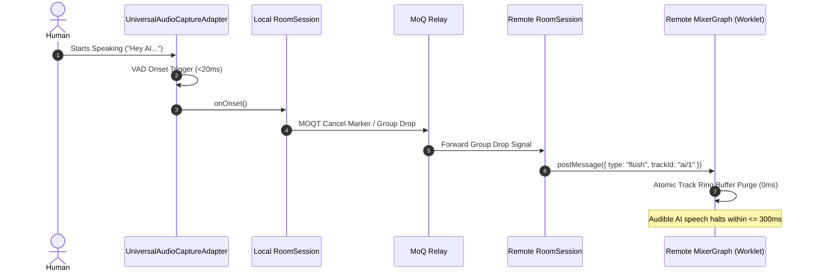
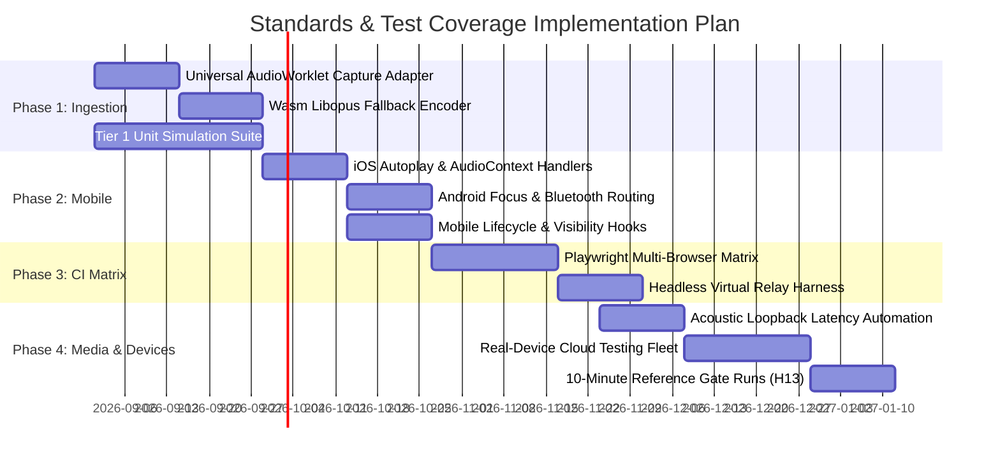

# Real Fabric — Platform Standards & Browser Compatibility Matrix

**Document Purpose:** Architectural standard, platform capability baseline, and test coverage roadmap for Real Fabric as a real-time multi-party voice platform over Media over QUIC (MOQT).  
**Status:** Living Standard & Evolution Specification  
**Date:** 25 August 2026  
**Language & Spelling:** UK English  

---

## 1. Executive Summary & Core Platform Invariants

Real Fabric demonstrates independent, unmixed audio tracks published and subscribed over WebTransport, HTTP/3, and QUIC through a MoQ relay. While the initial v1 stage demo focuses on a strictly verified desktop configuration, the end-state objective is a robust, ubiquitous calling platform supporting all modern desktop and mobile browsers across **macOS**, **Windows**, **iOS / iPadOS**, and **Android**.

```mermaid
flowchart TD
    subgraph Capture["Audio Capture & Ingestion (UniversalAudioCaptureAdapter)"]
        MIC[Microphone Input] --> GUM["getUserMedia (AEC, NS, AGC)"]
        GUM --> SRC["MediaStreamAudioSourceNode"]
        SRC --> WORKLET_CAP["AudioWorklet Capture Node (real-fabric-capture)"]
        WORKLET_CAP --> RING["20ms (960-sample) Lock-Free Ring Buffer"]
        RING --> ENCODER{"Opus Encoder Engine"}
        ENCODER -->|Native WebCodecs| WC_ENC["WebCodecs AudioEncoder"]
        ENCODER -->|Wasm Fallback| WASM_ENC["Wasm Libopus Encoder"]
        GUM -.->|Optional Zero-Copy Fast-Path| MSTP["MediaStreamTrackProcessor (Chromium only)"]
        MSTP -.-> WC_ENC
    end

    subgraph Transport["Transport Layer (MoqTransportAdapter)"]
        WC_ENC --> MOQT["MOQT Wire Framing (Draft 16/20/Standard)"]
        WASM_ENC --> MOQT
        MOQT --> WT["WebTransport over HTTP/3 & QUIC"]
        WT <===> RELAY["MoQ Relay (No Mixing / Flat Uplink)"]
    end

    subgraph Playout["Receive, Playout & Summing"]
        RELAY <===> WT_DOWN["WebTransport Downlink"]
        WT_DOWN --> DEDUPE["Playback Deduplicator"]
        DEDUPE --> JB["Adaptive Jitter Buffer (40–200ms)"]
        JB --> DRIFT["Drift Estimator (Sample Skew PPM)"]
        JB --> DECODER{"Opus Decoder Engine"}
        DECODER -->|Native WebCodecs| WC_DEC["WebCodecs AudioDecoder"]
        DECODER -->|Wasm Fallback| WASM_DEC["Wasm Libopus Decoder"]
        WC_DEC --> MIXER["MixerGraph (AudioWorklet Summing)"]
        WASM_DEC --> MIXER
        DRIFT -->|Dynamic Resampling (0.95–1.05x)| MIXER
        MIXER --> SPK["AudioContext Destination (Output Clock)"]
    end
```

### Core Platform Invariants

1. **Pure MOQT Transport:** All live voice media travels as discrete MOQT objects over WebTransport, HTTP/3, and QUIC. There is no WebRTC peer connection or WebSocket audio fallback in the build.
2. **Zero Server-Side Mixing:** Every participant (human or AI) publishes exactly one independent audio track. Mixing is performed exclusively on the listener's device inside a dedicated `AudioWorklet`.
3. **Flat Uplink Scaling:** Publisher uplink bandwidth remains strictly flat at one stream ($32\text{ kbit/s}$ Opus + overhead) regardless of room population; relay fan-out handles distribution.
4. **Universal Standard Capture:** Audio capture defaults to standard W3C Web Audio `AudioWorklet` processing across all browser engines, ensuring deterministic $20\text{ ms}$ framing and unified clock domain alignment.
5. **Open Membership & Graceful Degradation:** Rooms enforce no artificial participant cap. Capacity limits are managed through an explicit, user-visible degradation ladder rather than admission rejection.
6. **Truthful Telemetry:** Any unobservable platform metric is reported as **Not exposed**, never synthesised or defaulted to zero.
7. **Hardware Resilience:** Absence of capture hardware or microphone permission denial gracefully degrades the client into a listen-only subscriber mode with full protocol inspection.

---

## 2. Standards & Web Platform API Specifications

The Real Fabric architecture is grounded in the following IETF RFCs, Internet-Drafts, and W3C Web Standards:

| Standard / Specification | Governing Body | Maturity Status | Role in Real Fabric Architecture |
|---|---|---|---|
| **QUIC Transport Protocol** ([RFC 9000](https://www.rfc-editor.org/info/rfc9000/)) | IETF | Standards Track (RFC) | Underlying multiplexed, encrypted, connection-migratable UDP transport layer. |
| **HTTP/3** ([RFC 9114](https://www.rfc-editor.org/info/rfc9114/)) | IETF | Standards Track (RFC) | HTTP layer mapping streams, unidirectional pipelines, and control handshakes over QUIC. |
| **WebTransport** ([W3C WebTransport](https://www.w3.org/TR/webtransport/)) | W3C / IETF | W3C Working Draft | Browser API exposing bidirectional streams, unidirectional streams, and datagrams over HTTP/3. |
| **Media over QUIC Transport (MOQT)** ([draft-ietf-moq-transport](https://datatracker.ietf.org/doc/draft-ietf-moq-transport/)) | IETF MoQ WG | Internet-Draft (Target: `-20`; Operational: `-16`/`-14`) | Pub/sub protocol for track naming, namespaces, object hierarchies, priority delivery, and group cancellations. |
| **Web Audio API & AudioWorklet** ([W3C Web Audio API](https://www.w3.org/TR/webaudio/)) | W3C | W3C Recommendation | **Primary Standard for Capture and Playout:** Frame-accurate PCM clocking, deterministic $20\text{ ms}$ capture ring buffering, dynamic fractional resampling for clock drift correction, and multi-track audio summing. |
| **WebCodecs** ([W3C WebCodecs](https://www.w3.org/TR/webcodecs/)) | W3C | Candidate Recommendation Draft | Low-level hardware/software access to `AudioEncoder` and `AudioDecoder` for raw Opus frame processing. |
| **Opus Audio Codec** ([RFC 6716](https://www.rfc-editor.org/info/rfc6716/) / [RFC 7587](https://www.rfc-editor.org/info/rfc7587/)) | IETF | Standards Track (RFC) | Low-latency voice codec ($48\text{ kHz}$ mono, $32\text{ kbit/s}$, $20\text{ ms}$ packetisation, Discontinuous Transmission (DTX), Packet Loss Concealment (PLC)). |
| **Media Capture and Streams** ([W3C `getUserMedia`](https://www.w3.org/TR/mediacapture-streams/)) | W3C | W3C Recommendation | Secure capture of user microphone audio with constraints for Acoustic Echo Cancellation (AEC), Noise Suppression (NS), and Auto Gain Control (AGC). |
| **MediaStreamTrack Insertable Streams** ([W3C MediaStreamTrackProcessor](https://www.w3.org/TR/mediacapture-transform/)) | W3C | Working Draft | Optional Chromium-specific zero-copy optimization bridging `MediaStreamTrack` frames into WebCodecs `AudioData`. |
| **Web Permissions & Device API** ([W3C Permissions](https://www.w3.org/TR/permissions/)) | W3C | Working Draft / Recommendation | Monitoring hardware availability and handling dynamic peripheral hot-plugging (`ondevicechange`). |
| **Page Lifecycle & Visibility** ([W3C Page Visibility](https://www.w3.org/TR/page-visibility/)) | W3C | W3C Recommendation | Managing mobile backgrounding, tab suspension, battery optimisation, and audio focus retention. |

---

## 3. Platform & Browser Compatibility Matrix

The table below contrasts the **Latest Codebase Status** (v1 stage-demo baseline) against the **End-State Calling Platform Support** across desktop and mobile browsers on macOS, Windows, iOS, and Android.

### Compatibility Legend
- 🟢 **Full Support:** Natively supported in shipping browsers; verified and operational.
- 🟡 **Supported via Adapter / Worklet Bridge:** Functional using standardised web polyfills/bridges (e.g., standard AudioWorklet capture adapter or Wasm Opus fallback).
- 🔵 **Read-Only / Subscriber Only:** Client can subscribe and listen; publication disarmed due to missing platform capture hardware or permission.
- 🔴 **Blocked / Untested:** Missing platform capability, unverified draft negotiation, or explicitly warned in the UI.

| Platform (OS) | Browser & Engine | WebTransport (H3/QUIC) | WebCodecs Opus (Enc/Dec) | Capture Pipeline (Ingestion) | Playout & Summing (AudioWorklet) | Opus DTX & PLC Support | Mobile Lifecycle & Audio Gating | Latest Codebase Status (v1 Demo Baseline) | End-State Support (Full Call Platform) | Platform Gap & Resolution Strategy |
|---|---|:---:|:---:|:---:|:---:|:---:|:---:|---|---|---|
| **macOS** | **Google Chrome 141+** *(Blink)* | 🟢 Native | 🟢 Native | 🟢 `UniversalAudioCaptureAdapter` *(Default)* + MSTP Fast-Path | 🟢 `AudioWorkletNode` | 🟢 Verified via `isConfigSupported` | N/A (Desktop) | 🟢 **Primary Pinned Configuration** ([`pinnedConfiguration.ts`](src/shared/pinnedConfiguration.ts)) | 🟢 **Full First-Class Support** | None. Gold-standard reference platform. |
| **macOS** | **Microsoft Edge 141+** *(Blink)* | 🟢 Native | 🟢 Native | 🟢 `UniversalAudioCaptureAdapter` *(Default)* + MSTP Fast-Path | 🟢 `AudioWorkletNode` | 🟢 Verified | N/A (Desktop) | 🔴 Warning Banner (*"Not the tested configuration"*) | 🟢 **Full First-Class Support** | Align brand detection in [`pinnedConfiguration.ts`](src/shared/pinnedConfiguration.ts); identical Chromium engine. |
| **macOS** | **Apple Safari 26.4+** *(WebKit)* | 🟢 Native (Safari 26.4+) | 🟡 Dec native; Enc requires Opus config | 🟢 `UniversalAudioCaptureAdapter` *(Default)* | 🟢 `AudioWorkletNode` | 🟡 PLC native; DTX unexposed | N/A (Desktop) | 🔴 Warning Banner & Capture Exception | 🟢 **Full First-Class Support** | `UniversalAudioCaptureAdapter` standardises capture via `AudioWorkletNode` on WebKit. |
| **macOS** | **Mozilla Firefox 120+** *(Gecko)* | 🟢 Native | 🟡 WebCodecs behind pref / partial | 🟢 `UniversalAudioCaptureAdapter` *(Default)* | 🟢 `AudioWorkletNode` | 🟡 PLC native; DTX unexposed | N/A (Desktop) | 🔴 Warning Banner & Capture Exception | 🟡 **Full Support via Worklet Capture + Wasm Libopus** | Standard `UniversalAudioCaptureAdapter` + Wasm Libopus codec fallback where `window.AudioEncoder` is disabled. |
| **Windows** | **Google Chrome 141+** *(Blink)* | 🟢 Native | 🟢 Native | 🟢 `UniversalAudioCaptureAdapter` *(Default)* + MSTP Fast-Path | 🟢 `AudioWorkletNode` | 🟢 Verified | N/A (Desktop) | 🔴 Warning Banner (*"Platform is Windows"*) | 🟢 **Full First-Class Support** | Expand OS compatibility rules; Chromium codebase is fully shared with macOS. |
| **Windows** | **Microsoft Edge 141+** *(Blink)* | 🟢 Native | 🟢 Native | 🟢 `UniversalAudioCaptureAdapter` *(Default)* + MSTP Fast-Path | 🟢 `AudioWorkletNode` | 🟢 Verified | N/A (Desktop) | 🔴 Warning Banner (*"Not tested"*) | 🟢 **Full First-Class Support** | Remove OS/brand barrier for all Chromium 141+ builds. |
| **Windows** | **Mozilla Firefox 120+** *(Gecko)* | 🟢 Native | 🟡 WebCodecs behind pref / partial | 🟢 `UniversalAudioCaptureAdapter` *(Default)* | 🟢 `AudioWorkletNode` | 🟡 PLC native; DTX unexposed | N/A (Desktop) | 🔴 Warning Banner (*"Not tested"*) | 🟡 **Full Support via Worklet Capture + Wasm Libopus** | Standard `UniversalAudioCaptureAdapter` + Wasm Opus encoder. |
| **iOS / iPadOS** | **Apple Safari (iOS 26.4+)** *(WebKit)* | 🟢 Native (iOS 26.4+) | 🟡 Dec native; Enc constrained | 🟢 `UniversalAudioCaptureAdapter` *(Default)* | 🟢 `AudioWorkletNode` (Requires gesture) | 🟡 PLC native; DTX unexposed | 🟡 Strict Autoplay, background suspension, route changes | 🔵 **Read-Only / Untested Banner** (Capture throws missing API) | 🟡 **Full Two-Way Mobile Calling** | 1. `UniversalAudioCaptureAdapter` (`AudioWorklet`).<br>2. User gesture unlock for `AudioContext`.<br>3. `AVAudioSession` route tracking (`ondevicechange`).<br>4. Page visibility pause/resume handlers. |
| **iOS / iPadOS** | **Chrome / Firefox on iOS** *(WebKit)* | 🟢 Native (iOS 26.4+) | 🟡 WebKit engine constraints | 🟢 `UniversalAudioCaptureAdapter` *(Default)* | 🟢 `AudioWorkletNode` (Requires gesture) | 🟡 PLC native; DTX unexposed | 🟡 Strict Autoplay, background suspension | 🔵 **Read-Only / Untested Banner** | 🟡 **Full Two-Way Mobile Calling** | Identical WebKit runtime requirements as iOS Safari. |
| **Android** | **Google Chrome 141+** *(Blink)* | 🟢 Native | 🟢 Native | 🟢 `UniversalAudioCaptureAdapter` *(Default)* + MSTP Fast-Path | 🟢 `AudioWorkletNode` (Requires gesture) | 🟢 Verified | 🟡 Audio focus loss, Bluetooth SCO routing, Doze mode | 🔴 Warning Banner (*"Platform is Android"*) | 🟢 **Full First-Class Mobile Calling** | 1. User gesture audio initialisation.<br>2. Audio focus management (`AudioManager` interrupts).<br>3. Bluetooth headset SCO profile switching. |
| **Android** | **Samsung Internet 24+** *(Blink)* | 🟢 Native | 🟢 Native | 🟢 `UniversalAudioCaptureAdapter` *(Default)* + MSTP Fast-Path | 🟢 `AudioWorkletNode` | 🟢 Verified | 🟡 Audio focus loss, background throttling | 🔴 Warning Banner (*"Not tested"*) | 🟢 **Full First-Class Mobile Calling** | Remove brand restriction; inherit Chromium Android mobile audio path. |
| **Android** | **Mozilla Firefox for Android** *(Gecko)* | 🟢 Native | 🟡 WebCodecs partial | 🟢 `UniversalAudioCaptureAdapter` *(Default)* | 🟢 `AudioWorkletNode` | 🟡 PLC native; DTX unexposed | 🟡 Audio focus loss, Doze mode | 🔴 Warning Banner & Capture Exception | 🟡 **Full Support via Worklet Capture + Wasm Libopus** | Standard `UniversalAudioCaptureAdapter` + Wasm Libopus pipeline. |

---

## 4. Architectural Gaps & Technical Resolution

### 4.1 Ingestion Pipeline: Universal AudioWorklet by Default (`UniversalAudioCaptureAdapter`)

#### Current Codebase Constraint
[`CaptureController.ts`](src/client/audio/CaptureController.ts) currently relies on Chromium's proprietary `MediaStreamTrackProcessor` API:
```typescript
const processorConstructor = (globalThis as any).MediaStreamTrackProcessor;
if (!processorConstructor) {
  throw new Error("MediaStreamTrackProcessor is not exposed by this browser...");
}
```
This single check causes immediate hard failures on Safari (macOS & iOS) and Firefox, even when WebTransport and AudioWorklet are fully operational. Furthermore, `MediaStreamTrackProcessor` delivers variable-sized hardware audio buffer chunks (e.g. 128, 480, 512 samples) based on underlying audio hardware, introducing timestamp jitter, frame fragmentation, and chunk-stitching overhead.

#### End-State Architecture: `UniversalAudioCaptureAdapter` as Default

To establish ubiquitous cross-platform calling, `UniversalAudioCaptureAdapter` adopts standard W3C Web Audio `AudioWorklet` capture as the **primary default architecture**, treating `MediaStreamTrackProcessor` strictly as an optional zero-copy acceleration on Chromium.

```text
┌─────────────────────────────────────────────────────────────────────────────┐
│                    Microphone MediaStreamTrack (Mono 48kHz)                 │
└──────────────────────────────────────┬──────────────────────────────────────┘
                                       │
                         ┌─────────────┴─────────────┐
                         │ Feature & Config Selection │
                         └─────────────┬─────────────┘
                                       │
        ┌──────────────────────────────┴──────────────────────────────┐
        ▼ (Default Standard Path)                                     ▼ (Optional Fast-Path)
┌──────────────────────────────────────────────┐              ┌──────────────────────────────┐
│          MediaStreamAudioSourceNode          │              │  MediaStreamTrackProcessor   │
│                      │                       │              │              │               │
│                      ▼                       │              │              ▼               │
│ AudioWorkletNode ("real-fabric-capture")     │              │  ReadableStream<AudioData>   │
│                      │                       │              │              │               │
│                      ▼                       │              │              ▼               │
│ Lock-Free Ring Buffer (128 -> 960 samples)   │              │   Direct Zero-Copy AudioData │
│                      │                       │              └──────────────┬───────────────┘
│                      ▼                       │                             │
│ Transferable Float32Array (20ms / 48kHz)     │                             │
│ + Worklet-Thread VAD Energy Computation      │                             │
└──────────────────────┬───────────────────────┘                             │
                       │                                                     │
                       ▼                                                     ▼
┌────────────────────────────────────────────────────────────────────────────────────────────┐
│                       AudioCodecEngine (WebCodecs OR Wasm Libopus)                         │
└────────────────────────────────────────────────────────────────────────────────────────────┘
```

#### Architectural Rationale for Defaulting to AudioWorklet
1. **W3C Web Standard Baseline:** `MediaStreamAudioSourceNode` and `AudioWorkletNode` are standard W3C Recommendations implemented consistently across Blink, WebKit, and Gecko.
2. **Deterministic $20\text{ ms}$ Quantum Framing:** The worklet processor aggregates $128\text{-sample}$ Web Audio render slices into exact $20\text{ ms}$ ($960\text{ samples}$ at $48\text{ kHz}$) single-channel Float32 frames with monotonic timestamps directly on the audio thread, eliminating chunk-stitching and buffer jitter.
3. **Single Clock Domain Alignment:** Playout (`MixerGraph`) and capture (`UniversalAudioCaptureAdapter`) share the same unified Web Audio hardware clock, eliminating intra-client drift.
4. **Audio-Thread VAD Computation:** Voice activity energy (RMS and zero-crossing rate) is computed directly inside the worklet processor during sample aggregation, guaranteeing instant ($<20\text{ ms}$) onset detection for sub-300ms barge-in.
5. **Zero-Copy Memory Transfer:** Audio frames are posted from the audio thread to the codec engine using transferable `ArrayBuffer` allocations, guaranteeing zero garbage collection pauses on the real-time audio thread.

#### TypeScript Interface Specification
```typescript
export interface CaptureFrame {
  pcm: Float32Array;
  sampleRate: 48_000;
  samples: 960;
  timestampUs: number;
  energyRms: number;
}

export interface AudioCaptureAdapter {
  start(options: CaptureAdapterOptions): Promise<MediaStream>;
  stop(): Promise<void>;
  dtxEnabled(): Measurement<boolean>;
  readonly speaking: boolean;
  readonly level: number;
  stats(): CaptureStats;
}
```

---

### 4.2 Codec Layer: Universal Codec Abstraction (`AudioCodecEngine`)

#### Current Codebase Constraint
[`useCapabilities.ts`](src/client/hooks/useCapabilities.ts) and [`TrackPlayer.ts`](src/client/audio/TrackPlayer.ts) treat the absence of native `window.AudioEncoder` or `window.AudioDecoder` as a fatal `transport_unsupported` error, blocking browsers where WebCodecs Opus support is partial or behind user flags.

#### End-State Architecture: Abstract Codec Engine
The codec subsystem decouples audio encoding and decoding from browser-specific implementations through an abstract `AudioCodecEngine`:

```typescript
export interface AudioCodecEngine {
  encode(pcm: Float32Array, timestampUs: number): Promise<Uint8Array | null>;
  decode(opusFrame: Uint8Array, timestampUs: number): Promise<Float32Array>;
  isDtxSupported(): boolean;
  close(): void;
}
```

1. **Native WebCodecs Implementation:**
   - Wraps `AudioEncoder` and `AudioDecoder` using native OS hardware/software pipelines.
   - Probes DTX support via `AudioEncoder.isConfigSupported()` and configures $20\text{ ms}$ frame durations (`frameDuration: 20000`).
2. **Wasm Libopus Fallback Implementation:**
   - Compiles standard `libopus 1.5+` via Emscripten with SIMD optimisations and zero-copy memory views.
   - Provides deterministic Opus encoding ($48\text{ kHz}$, mono, $32\text{ kbit/s}$, VBR/CBR, native Opus DTX generation).
   - Generates native Opus Packet Loss Concealment (PLC) frames when missing packet payloads are signalled.

---

### 4.3 Multi-Clock Domain Synchronization & Real-Time Drift Mitigation

#### Problem Statement
In a distributed multi-party MOQT call, three independent clock domains interact:
1. **Publisher Capture Clock:** Governed by the sender's microphone audio hardware crystal oscillator.
2. **Network Transmission Clock:** Governed by QUIC packet arrival and network scheduling.
3. **Subscriber Playout Clock:** Governed by the listener's local DAC output hardware.

Physical hardware crystals drift by up to $\pm 1000\text{ ppm}$ ($\approx 3.6\text{ seconds per hour}$ or $\approx 48\text{ samples per second}$). Without continuous compensation, listener jitter buffers either underrun (clicks/gaps) or overflow (unbounded latency).


#### Technical Resolution
1. **Dynamic Skew Estimation:** [`DriftEstimator.ts`](src/client/audio/DriftEstimator.ts) tracks elapsed sender media time against local arrival time using linear regression over a 400-frame sliding window, reporting skew in PPM.
2. **Dynamic Fractional Resampling:** When skew is within the correctable range ($\pm 5\%$), `MixerGraph` applies fractional linear interpolation in the mixing worklet:
   $$\text{readIndex} \leftarrow \text{readIndex} + \text{ratio}$$
   A single adjustment step never exceeds $\pm 0.05\%$ per frame to prevent audible pitch warping.
3. **Pause-Gated Buffer Rebuilding:** For severe uncorrectable skew ($>5\%$) or network disruptions, `TrackPlayer` defers jitter buffer rebuilding until a natural pause in speech ($\ge 40\text{ ms}$ silence) detected by VAD, avoiding mid-word audio splices.

---

### 4.4 Mobile Operating System Hurdles & Mitigations

#### A. iOS / iPadOS (WebKit Engine)
1. **Autoplay & AudioContext Gesture Gating:**
   - *Problem:* WebKit halts audio output and microphone capture unless `AudioContext.resume()` is explicitly triggered inside a direct user-activated gesture event (`click` or `touchend`).
   - *Solution:* Gate all media creation behind an unambiguous "Join Room" or "Enable Audio" tap, ensuring the `AudioContext` transitions to `running` before connecting to WebTransport.
2. **Audio Session Interruptions (`AVAudioSession`):**
   - *Problem:* Incoming phone calls, Siri activation, or alarm notifications disrupt the WebKit audio subsystem, placing the `AudioContext` in an `interrupted` or `suspended` state.
   - *Solution:* Listen for `AudioContext.onstatechange` events. When state flips to `suspended`, display an amber reconnection banner and prompt the user to tap to resume audio without dropping MOQT track subscriptions.
3. **Background Tab Suspension:**
   - *Problem:* Mobile Safari throttles timers, freezes WebWorkers, and suspends WebTransport sessions after $\approx 30\text{ seconds}$ in the background.
   - *Solution:* Attach `document.addEventListener("visibilitychange")` listeners. On `hidden`, transmit an explicit MOQT pause/mute signal to the relay; on `visible`, execute an atomic session reconciliation using the $60\text{-second}$ rejoin token.

#### B. Android (Chrome & Blink Engines)
1. **Audio Focus Contention:**
   - *Problem:* Third-party apps taking temporary or permanent audio focus (e.g. navigation prompts) mute Web Audio without closing the WebTransport session.
   - *Solution:* Monitor output levels via an RMS analyzer in `MixerGraph`. Detect sustained uncommanded silence during remote speech and trigger audio graph reset.
2. **Bluetooth SCO & Earpiece Routing:**
   - *Problem:* Android browsers default to media output (A2DP) rather than telecommunication routing (SCO), causing microphone capture degradation and acoustic echo.
   - *Solution:* Enforce standard communications constraints in `getUserMedia` (`echoCancellation: true`, `noiseSuppression: true`, `channelCount: 1`), prompting the browser to request Android communication audio routing.

---

### 4.5 Fast Sub-300ms Barge-In Cancellation & Receiver Buffer Purging

#### Invariant Requirement (H6)
When a human begins speaking to an active AI participant, the AI's audible speech must cease within **$300\text{ ms}$** across all listening clients, including all audio queued in downstream jitter buffers and worklet mixers.



#### Technical Resolution
1. **Instantaneous Capture Onset:** `UniversalAudioCaptureAdapter` detects energy elevation in the capture worklet within $<20\text{ ms}$ of human phonation and emits `onOnset()`.
2. **MOQT Priority Cancellation:** The local room session immediately terminates the current AI group and dispatches an out-of-band cancellation marker.
3. **Atomic Receiver Playout Flush:** On receipt of the cancellation signal, the receiver's `TrackPlayer` and `MixerGraph` atomically purge the AI track's jitter buffer and worklet ring buffer, ensuring zero trailing speech packets play out.

---

### 4.6 Real-Time Audio Thread Safety & Zero-Allocation Memory Model

#### Invariant Requirement (H13)
Audio processing on the `AudioWorklet` thread must strictly maintain real-time safety invariants to prevent audio underruns, glitches, or thread blocking:

1. **Zero Dynamic Allocations in `process()`:** The `AudioWorkletProcessor.process()` callback must never invoke `new`, allocate closures, or resize arrays. All memory (ring buffers, scratch arrays, lookup tables) must be pre-allocated during processor initialisation.
2. **Pre-Allocated Lock-Free Circular Buffers:** Inter-thread audio transfers utilise pre-allocated `Float32Array` ring buffers with power-of-two sizing and modulo indexing.
3. **Transferable Memory Transfers:** Data posted between the main thread and audio worklet threads via `port.postMessage` must transfer `ArrayBuffer` ownership (`[buffer]`) rather than performing deep memory cloning.
4. **Deterministic Peak Limiting:** Multi-track summation applies branchless soft-knee peak limiting rather than dynamic attenuation, preventing volume pumping regardless of participant count.

---

## 5. Test Coverage Expansion Roadmap

To transition Real Fabric from a stage demo with 113 focused invariant tests into a resilient, production-ready calling platform, automated test coverage must expand across four concrete testing tiers.


---

### 5.1 Tier 1: Unit & Subsystem Capability Simulation Tests

*Target: Fast in-memory unit tests simulating all browser and platform variations.*

1. **User Agent & Capability Matrix Testing:**
   - Construct comprehensive fixtures in [`test/invariants.test.ts`](test/invariants.test.ts) covering:
     - iOS Safari (missing `MediaStreamTrackProcessor`, locked `AudioContext`).
     - macOS Safari (missing `MediaStreamTrackProcessor`, native `AudioDecoder`).
     - Desktop Firefox (missing `MediaStreamTrackProcessor`, missing `AudioEncoder`).
     - Android Chrome (mobile brands, audio focus events).
     - Windows Edge & Chrome (Chromium brands on Windows).
   - Assert that [`matchConfiguration`](src/shared/pinnedConfiguration.ts) and [`useCapabilities`](src/client/hooks/useCapabilities.ts) emit truthful, non-fatal reports without silent failures.

2. **Universal AudioWorklet Capture Pipeline Unit Tests:**
   - Mock `AudioWorkletProcessor` sample collection.
   - Verify that streaming $128\text{-sample}$ Web Audio quantum slices correctly assemble into exact $20\text{ ms}$ ($960\text{ sample}$) frames with continuous timestamps and no phase discontinuity.

3. **Codec Parity & Fallback Verification:**
   - Execute side-by-side encode/decode loops comparing native WebCodecs with Wasm Libopus.
   - Validate that both pipelines produce conformant Opus packets, handle DTX comfort noise transitions, and synthesise PLC frames on simulated missing objects.

4. **Mobile Lifecycle State Machine Tests:**
   - Unit test `ReconnectionPolicy` and `RoomSession` against simulated `visibilitychange`, `freeze`, and `resume` DOM events.
   - Verify that backgrounding cleanly schedules track suspension and restores identity within the $60\text{-second}$ window.

---

### 5.2 Tier 2: Headless Cross-Browser Matrix Integration Tests (Playwright / WebDriver BiDi)

*Target: Automated multi-browser continuous integration testing.*

1. **Multi-Engine CI Matrix:**
   - Configure Playwright to execute test suites against:
     - **Chromium** (Desktop macOS/Windows & Mobile Android Emulation).
     - **WebKit** (macOS Safari & Mobile iOS Emulation).
     - **Firefox** (Gecko Desktop).
2. **Headless Virtual MoQ Relay:**
   - Implement an in-memory, lightweight MOQT relay running inside the test runner or a local process.
   - Establish live WebTransport sessions over HTTP/3 in headless Chromium and Firefox.
   - Verify publisher-subscriber handshakes, `SUBSCRIBE_NAMESPACE` discovery, and real-time edge mutations on the inspector graph.
3. **Automated Pre-Flight Validation:**
   - Run the pre-flight verification suite (`/preflight`) across all browser targets.
   - Assert that unsupported features render the exact failure code from the §10 Failure State Registry (`transport_unsupported`, `microphone_no_device`, `draft_endpoint_missing`) with relevant user recovery copy.

---

### 5.3 Tier 3: Media Pipeline, Drift, Barge-In & Acoustic Loopback Tests

*Target: Rigorous media-plane validation meeting §9.3 latency and §9.4 acoustic loopback requirements.*

1. **Automated Acoustic Loopback Harness (§9.4):**
   - Inject a deterministic synthetic click train into the publisher's audio capture.
   - Capture decoded PCM from the subscriber's `MixerGraph` output.
   - Perform automated cross-correlation to measure one-way latency.
   - Assert acceptance gates: $\text{p50} < 250\text{ ms}$ and $\text{p95} < 500\text{ ms}$ under nominal network conditions.

2. **Clock Drift Simulation & Stress Testing:**
   - Inject synthetic sender clock skews from $-1000\text{ ppm}$ to $+1000\text{ ppm}$ across 50,000 continuous frames.
   - Verify that [`DriftEstimator`](src/client/audio/DriftEstimator.ts) dynamically adjusts the resampling ratio without audible pitch artefacts.
   - Trigger severe drift ($>5\%$) and confirm that `TrackPlayer` executes graceful jitter-buffer rebuilding at detected speech pauses (`drift_uncorrectable`).

3. **Sub-300ms Barge-In Stress Verification (H6):**
   - Stream high-volume AI speech packets into the receiver.
   - Fire a human speech onset event from `VoiceActivityDetector`.
   - Measure elapsed time until the subscriber's `MixerGraph` flushes and drops remaining group objects.
   - Assert that playout halts within $\le 300\text{ ms}$ across 100 consecutive trials.

4. **Degradation Ladder Automated Load Test (H7):**
   - Simulate an open room scaling from 1 to 50 concurrent active tracks.
   - Monitor simulated CPU decoding time and jitter buffer depth.
   - Assert that the client systematically engages:
     - *Step 1:* Nominal buffer expansion ($60\text{ ms} \rightarrow 120\text{ ms}$).
     - *Step 2:* Decoder release for tracks silent $>30\text{ s}$.
     - *Step 3:* Unsubscribing least-recently-active speakers with active UI notification.

---

### 5.4 Tier 4: Real-Device Mobile & Network Resilience Testing

*Target: Verification under real-world network and device conditions.*

1. **Real Device Cloud Testing Grid:**
   - Execute automated smoke tests on real physical devices via device cloud providers:
     - **iOS:** iPhone 14/15/16 running iOS 17 & iOS 18 (Safari & Chrome).
     - **Android:** Google Pixel 8/9 & Samsung Galaxy S23/S24 running Android 14 & 15.
     - **Windows:** Surface Pro / Windows 11 on Edge & Chrome.
     - **macOS:** Apple Silicon on Chrome, Safari, and Firefox.
2. **Network Impairment & UDP Filtering Tests:**
   - Validate application behaviour under simulated cellular constraints using network shaping tools:
     - $5\%$ to $15\%$ random packet loss (verifying Opus PLC and jitter adaptation).
     - Out-of-order packet delivery (verifying sequence reordering in `AdaptiveJitterBuffer`).
     - Hard UDP blocking (verifying immediate, truthful `udp_blocked` failure banner and mobile hotspot guidance).
3. **QUIC Connection Migration & Wi-Fi to 5G Handover:**
   - Test client migration between Wi-Fi and mobile data interfaces.
   - Verify that the underlying QUIC transport migrates the connection without terminating the MOQT session or dropping active voice tracks.
4. **Continuous 10-Minute Stability Run (H13):**
   - Execute the 10-minute reference composition ($6\text{ humans} + 2\text{ AIs}$) continuously on mobile and desktop devices.
   - Verify zero memory leaks, constant heap bounds, stable jitter buffer depth ($40\text{--}200\text{ ms}$), and zero uncorrected audio drift.

---

## 6. Delivery Milestones & Test Coverage Targets

The table below outlines the sequential phases to deliver universal browser support and comprehensive test coverage.



| Phase | Milestone Name | Key Technical Deliverables | Associated Test Coverage Deliverables | Target Coverage Gate |
|---|---|---|---|:---:|
| **Phase 1** | **Universal Ingestion & Codec Abstraction** | - `UniversalAudioCaptureAdapter` (Worklet capture default across all browsers, MSTP fast-path).<br>- Wasm Libopus fallback for browsers lacking native WebCodecs Opus.<br>- Abstract `AudioCodecEngine` interface. | - Unit test matrix for all browser capture permutations.<br>- Wasm vs native WebCodecs encode/decode parity tests.<br>- Opus DTX & PLC synthesis test suite. | $>85\%$ Audio Engine Unit Coverage |
| **Phase 2** | **Mobile Web & OS Lifecycle Hardening** | - iOS `AudioContext` gesture unlock & `AVAudioSession` interruption handlers.<br>- Android audio focus management and Bluetooth SCO routing.<br>- Page visibility & background suspension hooks with atomic $60\text{s}$ rejoin. | - Mobile lifecycle simulation tests (`visibilitychange`, `freeze`, `interrupted`).<br>- Touch gesture unlock assertion tests.<br>- Peripheral hot-plugging (`ondevicechange`) tests. | $>90\%$ Session & Lifecycle Coverage |
| **Phase 3** | **Automated Multi-Browser CI Matrix** | - Playwright integration test suite across Chromium, WebKit, and Gecko.<br>- Headless virtual MoQ relay for deterministic CI runs.<br>- Cross-browser pre-flight suite automation. | - Automated E2E verification across Chrome, Safari, Edge, Firefox, and mobile viewports.<br>- §10 failure mode trigger tests in all engines. | $100\%$ Pre-flight & Failure Mode E2E Coverage |
| **Phase 4** | **Acoustic Latency & Real-Device Validation** | - Automated §9.4 single-machine acoustic loopback test harness.<br>- QUIC connection migration validation (Wi-Fi $\leftrightarrow$ 5G).<br>- Real-device cloud execution (iOS & Android). | - Automated p50/p95 latency validation ($\text{p50} < 250\text{ ms}$, $\text{p95} < 500\text{ ms}$).<br>- Sub-300ms barge-in latency verification.<br>- 10-minute continuous reference composition run (H13). | Full Release Gate & H1–H16 Verification |

---

## 7. Definition of Platform Support Done

A browser/OS combination is declared **Supported** as a call platform only when:
1. **Two-Way Audio Proven:** Clean audio capture via `UniversalAudioCaptureAdapter`, Opus encoding, WebTransport publishing, MOQT subscription, decoding, and listener-side AudioWorklet mixing operate continuously for $10\text{ minutes}$ without audible degradation.
2. **Zero False Fallbacks:** The platform strictly adheres to MOQT over WebTransport/QUIC; no undercover WebRTC or WebSocket fallback exists in the media path.
3. **Telemetry Truthfulness:** Any unexposed browser metric reads **Not exposed**, never defaulted to zero or an estimate.
4. **Lifecycle Resilient:** The application cleanly recovers identity, subscriptions, and routing preferences within $60\text{ seconds}$ of page reload, route change, or temporary backgrounding.
5. **Automated CI Gated:** The target browser configuration is covered by automated CI tests and reports passing status on every build.
