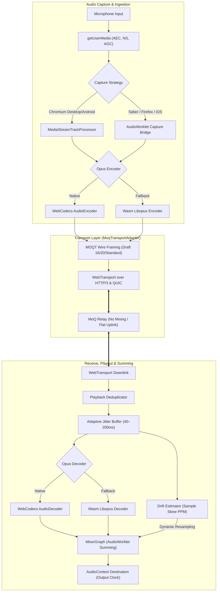

# Real Fabric — Platform Standards & Browser Compatibility Matrix

**Document Purpose:** Architectural standard, platform capability baseline, and test coverage roadmap for Real Fabric as a real-time multi-party voice platform over Media over QUIC (MOQT).  
**Status:** Living Standard & Evolution Specification  
**Date:** 25 August 2026  
**Language & Spelling:** UK English  

---

## 1. Executive Summary & Core Platform Invariants

Real Fabric demonstrates independent, unmixed audio tracks published and subscribed over WebTransport, HTTP/3, and QUIC through a MoQ relay. While the initial v1 stage demo focuses on a strictly verified desktop configuration, the end-state objective is a robust, ubiquitous calling platform supporting all modern desktop and mobile browsers across **macOS**, **Windows**, **iOS / iPadOS**, and **Android**.



### Core Platform Invariants

1. **Pure MOQT Transport:** All live voice media travels as discrete MOQT objects over WebTransport, HTTP/3, and QUIC. There is no WebRTC peer connection or WebSocket audio fallback in the build.
2. **Zero Server-Side Mixing:** Every participant (human or AI) publishes exactly one independent audio track. Mixing is performed exclusively on the listener's device inside a dedicated `AudioWorklet`.
3. **Flat Uplink Scaling:** Publisher uplink bandwidth remains strictly flat at one stream ($32\text{ kbit/s}$ Opus + overhead) regardless of room population; relay fan-out handles distribution.
4. **Open Membership & Graceful Degradation:** Rooms enforce no artificial participant cap. Capacity limits are managed through an explicit, user-visible degradation ladder rather than admission rejection.
5. **Truthful Telemetry:** Any unobservable platform metric is reported as **Not exposed**, never synthesised or defaulted to zero.
6. **Hardware Resilience:** Absence of capture hardware or microphone permission denial gracefully degrades the client into a listen-only subscriber mode with full protocol inspection.

---

## 2. Standards & Web Platform API Specifications

The Real Fabric architecture is grounded in the following IETF RFCs, Internet-Drafts, and W3C Web Standards:

| Standard / Specification | Governing Body | Maturity Status | Role in Real Fabric Architecture |
|---|---|---|---|
| **QUIC Transport Protocol** ([RFC 9000](https://www.rfc-editor.org/info/rfc9000/)) | IETF | Standards Track (RFC) | Underlying multiplexed, encrypted, connection-migratable UDP transport layer. |
| **HTTP/3** ([RFC 9114](https://www.rfc-editor.org/info/rfc9114/)) | IETF | Standards Track (RFC) | HTTP layer mapping streams, unidirectional pipelines, and control handshakes over QUIC. |
| **WebTransport** ([W3C WebTransport](https://www.w3.org/TR/webtransport/)) | W3C / IETF | W3C Working Draft | Browser API exposing bidirectional streams, unidirectional streams, and datagrams over HTTP/3. |
| **Media over QUIC Transport (MOQT)** ([draft-ietf-moq-transport](https://datatracker.ietf.org/doc/draft-ietf-moq-transport/)) | IETF MoQ WG | Internet-Draft (Target: `-20`; Operational: `-16`/`-14`) | Pub/sub protocol for track naming, namespaces, object hierarchies, priority delivery, and group cancellations. |
| **WebCodecs** ([W3C WebCodecs](https://www.w3.org/TR/webcodecs/)) | W3C | Candidate Recommendation Draft | Low-level hardware/software access to `AudioEncoder` and `AudioDecoder` for raw Opus frame processing. |
| **Opus Audio Codec** ([RFC 6716](https://www.rfc-editor.org/info/rfc6716/) / [RFC 7587](https://www.rfc-editor.org/info/rfc7587/)) | IETF | Standards Track (RFC) | Low-latency voice codec ($48\text{ kHz}$ mono, $32\text{ kbit/s}$, $20\text{ ms}$ packetisation, Discontinuous Transmission (DTX), Packet Loss Concealment (PLC)). |
| **Web Audio API & AudioWorklet** ([W3C Web Audio API](https://www.w3.org/TR/webaudio/)) | W3C | W3C Recommendation | Frame-accurate PCM clocking, dynamic fractional resampling for clock drift correction, and multi-track audio summing. |
| **Media Capture and Streams** ([W3C `getUserMedia`](https://www.w3.org/TR/mediacapture-streams/)) | W3C | W3C Recommendation | Secure capture of user microphone audio with constraints for Acoustic Echo Cancellation (AEC), Noise Suppression (NS), and Auto Gain Control (AGC). |
| **MediaStreamTrack Insertable Streams** ([W3C MediaStreamTrackProcessor](https://www.w3.org/TR/mediacapture-transform/)) | W3C | Working Draft | Direct stream transformation bridging raw `MediaStreamTrack` frames into WebCodecs `AudioData`. |
| **Web Permissions & Device API** ([W3C Permissions](https://www.w3.org/TR/permissions/)) | W3C | Working Draft / Recommendation | Monitoring hardware availability and handling dynamic peripheral hot-plugging (`ondevicechange`). |
| **Page Lifecycle & Visibility** ([W3C Page Visibility](https://www.w3.org/TR/page-visibility/)) | W3C | W3C Recommendation | Managing mobile backgrounding, tab suspension, battery optimization, and audio focus retention. |

---

## 3. Platform & Browser Compatibility Matrix

The table below contrasts the **Latest Codebase Status** (v1 stage-demo baseline) against the **End-State Calling Platform Support** across desktop and mobile browsers on macOS, Windows, iOS, and Android.

### Compatibility Legend
- 🟢 **Full Support:** Natively supported in shipping browsers; verified and operational.
- 🟡 **Supported via Adapter / Worklet Bridge:** Functional using standardized web polyfills/bridges (e.g., AudioWorklet capture fallback or Wasm Opus).
- 🔵 **Read-Only / Subscriber Only:** Client can subscribe and listen; publication disarmed due to missing platform capture API.
- 🔴 **Blocked / Untested:** Missing platform capability, unverified draft negotiation, or explicitly warned in the UI.

| Platform (OS) | Browser & Engine | WebTransport (H3/QUIC) | WebCodecs Opus (Enc/Dec) | Capture Pipeline (Ingestion) | Playout & Summing (AudioWorklet) | Opus DTX & PLC Support | Mobile Lifecycle & Audio Gating | Latest Codebase Status (v1 Demo Baseline) | End-State Support (Full Call Platform) | Platform Gap & Resolution Strategy |
|---|---|:---:|:---:|:---:|:---:|:---:|:---:|---|---|---|
| **macOS** | **Google Chrome 141+** *(Blink)* | 🟢 Native | 🟢 Native | 🟢 `MediaStreamTrackProcessor` | 🟢 `AudioWorkletNode` | 🟢 Verified via `isConfigSupported` | N/A (Desktop) | 🟢 **Primary Pinned Configuration** ([`pinnedConfiguration.ts`](src/shared/pinnedConfiguration.ts)) | 🟢 **Full First-Class Support** | None. Gold-standard reference platform. |
| **macOS** | **Microsoft Edge 141+** *(Blink)* | 🟢 Native | 🟢 Native | 🟢 `MediaStreamTrackProcessor` | 🟢 `AudioWorkletNode` | 🟢 Verified | N/A (Desktop) | 🔴 Warning Banner (*"Not the tested configuration"*) | 🟢 **Full First-Class Support** | Align brand detection in [`pinnedConfiguration.ts`](src/shared/pinnedConfiguration.ts); identical Chromium engine. |
| **macOS** | **Apple Safari 26.4+** *(WebKit)* | 🟢 Native (Safari 26.4+) | 🟡 Dec native; Enc requires Opus config | 🟡 Missing `MediaStreamTrackProcessor` | 🟢 `AudioWorkletNode` | 🟡 PLC native; DTX unexposed | N/A (Desktop) | 🔴 Warning Banner & Capture Exception | 🟡 **Full Support via Worklet Capture Bridge** | Implement `AudioWorklet` capture node to extract PCM frames from `MediaStreamAudioSourceNode` into WebCodecs/Wasm encoder. |
| **macOS** | **Mozilla Firefox 120+** *(Gecko)* | 🟢 Native | 🟡 WebCodecs behind pref / partial | 🟡 Missing `MediaStreamTrackProcessor` | 🟢 `AudioWorkletNode` | 🟡 PLC native; DTX unexposed | N/A (Desktop) | 🔴 Warning Banner & Capture Exception | 🟡 **Full Support via Worklet Capture + Wasm Libopus** | Add Wasm Libopus encoder fallback where `window.AudioEncoder` is disabled or unsupported. |
| **Windows** | **Google Chrome 141+** *(Blink)* | 🟢 Native | 🟢 Native | 🟢 `MediaStreamTrackProcessor` | 🟢 `AudioWorkletNode` | 🟢 Verified | N/A (Desktop) | 🔴 Warning Banner (*"Platform is Windows"*) | 🟢 **Full First-Class Support** | Expand OS compatibility rules; Chromium codebase is fully shared with macOS. |
| **Windows** | **Microsoft Edge 141+** *(Blink)* | 🟢 Native | 🟢 Native | 🟢 `MediaStreamTrackProcessor` | 🟢 `AudioWorkletNode` | 🟢 Verified | N/A (Desktop) | 🔴 Warning Banner (*"Not tested"*) | 🟢 **Full First-Class Support** | Remove OS/brand barrier for all Chromium 141+ builds. |
| **Windows** | **Mozilla Firefox 120+** *(Gecko)* | 🟢 Native | 🟡 WebCodecs behind pref / partial | 🟡 Missing `MediaStreamTrackProcessor` | 🟢 `AudioWorkletNode` | 🟡 PLC native; DTX unexposed | N/A (Desktop) | 🔴 Warning Banner (*"Not tested"*) | 🟡 **Full Support via Worklet Capture + Wasm Libopus** | Deploy universal AudioWorklet capture node + Wasm Opus encoder. |
| **iOS / iPadOS** | **Apple Safari (iOS 26.4+)** *(WebKit)* | 🟢 Native (iOS 26.4+) | 🟡 Dec native; Enc constrained | 🟡 Missing `MediaStreamTrackProcessor` | 🟢 `AudioWorkletNode` (Requires gesture) | 🟡 PLC native; DTX unexposed | 🟡 Strict Autoplay, background suspension, route changes | 🔵 **Read-Only / Untested Banner** (Capture throws missing API) | 🟡 **Full Two-Way Mobile Calling** | 1. AudioWorklet capture bridge.<br>2. User gesture unlock for `AudioContext`.<br>3. `AVAudioSession` route tracking (`ondevicechange`).<br>4. Page visibility pause/resume handlers. |
| **iOS / iPadOS** | **Chrome / Firefox on iOS** *(WebKit)* | 🟢 Native (iOS 26.4+) | 🟡 WebKit engine constraints | 🟡 Missing `MediaStreamTrackProcessor` | 🟢 `AudioWorkletNode` (Requires gesture) | 🟡 PLC native; DTX unexposed | 🟡 Strict Autoplay, background suspension | 🔵 **Read-Only / Untested Banner** | 🟡 **Full Two-Way Mobile Calling** | Identical WebKit runtime requirements as iOS Safari. |
| **Android** | **Google Chrome 141+** *(Blink)* | 🟢 Native | 🟢 Native | 🟢 `MediaStreamTrackProcessor` | 🟢 `AudioWorkletNode` (Requires gesture) | 🟢 Verified | 🟡 Audio focus loss, Bluetooth SCO routing, Doze mode | 🔴 Warning Banner (*"Platform is Android"*) | 🟢 **Full First-Class Mobile Calling** | 1. User gesture audio initialization.<br>2. Audio focus management (`AudioManager` interrupts).<br>3. Bluetooth headset SCO profile switching. |
| **Android** | **Samsung Internet 24+** *(Blink)* | 🟢 Native | 🟢 Native | 🟢 `MediaStreamTrackProcessor` | 🟢 `AudioWorkletNode` | 🟢 Verified | 🟡 Audio focus loss, background throttling | 🔴 Warning Banner (*"Not tested"*) | 🟢 **Full First-Class Mobile Calling** | Remove brand restriction; inherit Chromium Android mobile audio path. |
| **Android** | **Mozilla Firefox for Android** *(Gecko)* | 🟢 Native | 🟡 WebCodecs partial | 🟡 Missing `MediaStreamTrackProcessor` | 🟢 `AudioWorkletNode` | 🟡 PLC native; DTX unexposed | 🟡 Audio focus loss, Doze mode | 🔴 Warning Banner & Capture Exception | 🟡 **Full Support via Worklet Capture + Wasm Libopus** | Worklet capture bridge + Wasm Libopus pipeline. |

---

## 4. Architectural Gaps & Technical Resolution

### 4.1 Ingestion Pipeline: `MediaStreamTrackProcessor` vs Universal AudioWorklet Bridge

#### Current Codebase Constraint
[`CaptureController.ts`](src/client/audio/CaptureController.ts) directly relies on Chromium's proprietary `MediaStreamTrackProcessor` API:
```typescript
const processorConstructor = (globalThis as any).MediaStreamTrackProcessor;
if (!processorConstructor) {
  throw new Error("MediaStreamTrackProcessor is not exposed by this browser...");
}
```
This single check blocks audio publishing on Safari (macOS & iOS) and Firefox, even when WebTransport and AudioWorklet are fully operational.

#### End-State Architecture: `UniversalAudioCaptureAdapter`
To enable ubiquitous call publishing, the audio capture subsystem must adopt a dual-strategy ingestion engine:

```text
┌────────────────────────────────────────────────────────┐
│             Microphone MediaStreamTrack                │
└───────────────────────────┬────────────────────────────┘
                            │
              ┌─────────────┴─────────────┐
              │ Feature Detection Check   │
              └─────────────┬─────────────┘
                            │
       ┌────────────────────┴────────────────────┐
       ▼                                         ▼
[Chromium Path]                           [Universal Web Audio Path]
MediaStreamTrackProcessor                 MediaStreamAudioSourceNode
       │                                         │
ReadableStream<AudioData>                 AudioWorkletNode ("capture-worklet")
       │                                         │
       │ (Direct zero-copy)               RingBuffer -> 20ms Float32Array
       │                                         │
       ▼                                         ▼
WebCodecs AudioEncoder                    AudioEncoder OR Wasm Libopus
```

1. **Primary Path (Chromium Desktop & Android):** Zero-copy `MediaStreamTrackProcessor` directly piping `AudioData` chunks into `AudioEncoder`.
2. **Universal Fallback Path (Safari, Firefox, iOS):** 
   - Connect the `MediaStream` to a `MediaStreamAudioSourceNode`.
   - Route through an `AudioWorkletProcessor` (`capture-worklet.js`) buffering raw PCM into discrete $20\text{ ms}$ ($960\text{ samples}$ at $48\text{ kHz}$) single-channel Float32 frames.
   - Dispatch PCM buffers to `AudioEncoder` (or the Wasm Libopus fallback worker).

---

### 4.2 Codec Layer: WebCodecs vs WebAssembly Libopus Fallback

#### Current Codebase Constraint
[`useCapabilities.ts`](src/client/hooks/useCapabilities.ts) and [`TrackPlayer.ts`](src/client/audio/TrackPlayer.ts) treat the absence of native `window.AudioEncoder` or `window.AudioDecoder` as a fatal `transport_unsupported` error.

#### End-State Architecture: Abstract Codec Engine
```typescript
export interface AudioCodecEngine {
  encode(pcm: Float32Array, timestampUs: number): Promise<Uint8Array>;
  decode(opusFrame: Uint8Array, timestampUs: number): Promise<Float32Array>;
  isDtxSupported(): boolean;
  close(): void;
}
```
- **Native Implementation:** Wraps `AudioEncoder` and `AudioDecoder` with hardware acceleration and native Opus DTX negotiation.
- **Wasm Libopus Implementation:** Compiles standard `libopus 1.5+` via Emscripten with SIMD optimizations. Ensures deterministic $20\text{ ms}$ packetisation, Opus DTX generation, and native PLC packet synthesis on browsers lacking native WebCodecs Opus support.

---

### 4.3 Mobile Operating System Hurdles & Mitigations

#### A. iOS / iPadOS (WebKit Engine)
1. **Autoplay & AudioContext Gesture Gating:**
   - *Problem:* WebKit halts audio output and capture unless `AudioContext.resume()` is explicitly triggered inside a direct user-activated gesture event (`click` or `touchend`).
   - *Solution:* Gate all media creation behind an unambiguous "Join Room" or "Enable Audio" tap, ensuring the `AudioContext` transitions to `running` before connecting to WebTransport.
2. **Audio Session Interruptions (`AVAudioSession`):**
   - *Problem:* Incoming phone calls, Siri activation, or alarm notifications disrupt the WebKit audio subsystem, placing the `AudioContext` in an `interrupted` state.
   - *Solution:* Listen for `AudioContext.onstatechange` events. When state flips to `suspended`, display an amber reconnection banner and prompt the user to tap to resume audio without dropping MOQT track subscriptions.
3. **Background Tab Suspension:**
   - *Problem:* Mobile Safari throttles timers, freezes WebWorkers, and suspends WebTransport sessions after $\approx 30\text{ seconds}$ in the background.
   - *Solution:* Attach `document.addEventListener("visibilitychange")` listeners. On `hidden`, transmit an explicit MOQT pause/mute signal to the relay; on `visible`, execute an atomic session reconciliation using the $60\text{-second}$ rejoin token.

#### B. Android (Chrome & Blink Engines)
1. **Audio Focus Contention:**
   - *Problem:* Third-party apps taking temporary or permanent audio focus (e.g. navigation prompts) mute Web Audio without closing the WebTransport session.
   - *Solution:* Monitor output levels via an RMS analyzer in `MixerGraph`. Detect sustained uncommanded silence during remote speech and trigger audio graph reset.
2. **Bluetooth SCO & Earpiece Routing:**
   - *Problem:* Android browsers default to media output (A2DP) rather than telecommunication routing (SCO), causing microphone capture degradation and acoustic echo.
   - *Solution:* Enforce standard communications constraints in `getUserMedia` (`echoCancellation: true`, `noiseSuppression: true`, `channelCount: 1`), prompting the browser to request Android communication audio routing.

---

## 5. Test Coverage Expansion Roadmap

To transition Real Fabric from an initial stage demo with 76 focused invariant tests into a resilient, production-ready multi-party calling platform, automated test coverage must expand systematically across four concrete testing tiers.

Because Real Fabric bridges protocol standardisation, multi-party media routing, and evolving browser capabilities, code coverage enforcement must respect **two interrelated milestone dimensions**:
1. **v1 Stage-Demo Delivery Milestones & Acceptance Gates (Milestones 1–4, Gates 1–4, H1–H16)** from [`PRODUCT_SPEC_v1-demo_1.md`](PRODUCT_SPEC_v1-demo_1.md).
2. **Platform Standards & Universal Browser Evolution Phases (Phases 1–4)** defined in §6.
3. **Future MOQT Draft-20 Standard Gate** unblocking native draft-20 relay interoperability.

```mermaid
flowchart TD
    subgraph GATES["Milestone & Protocol Dependency Gates"]
        G1["Milestone 1 (Gate 1): Live Transport & Relay Interop (Draft-16)"]
        G2["Milestone 2 (Gate 2): Hardware Resilience & Audio Pipeline"]
        G3["Milestone 3 (Gate 3): Multi-Agent AI & Floor Control"]
        G4["Milestone 4 (Gate 4): Discovery, Rejoin & Capacity Scaling"]
        P1["Phase 1: Universal Ingestion & Codec Abstraction"]
        P2["Phase 2: Mobile Web & OS Lifecycle Hardening"]
        P3["Phase 3: Automated Multi-Browser CI Matrix"]
        P4["Phase 4: Acoustic Latency & Real-Device Validation"]
    end

    subgraph T1["Tier 1: Unit & Subsystem Simulation (Fast In-Memory)"]
        U1["1.1 Capability Diagnostic Matrix<br><i>[Status: Active / Immediate]</i>"]
        U2["1.2 AudioWorklet Capture Pipeline<br><i>[Await: Phase 1]</i>"]
        U3["1.3 Codec Parity (WebCodecs vs Wasm)<br><i>[Await: Phase 1]</i>"]
        U4["1.4 Mobile Lifecycle State Machine<br><i>[Await: Phase 2]</i>"]
        U5["1.5 Invariant & Contract Safety<br><i>[Status: Active / Immediate]</i>"]
    end

    subgraph T2["Tier 2: Headless Cross-Browser Matrix (Playwright CI)"]
        M1["2.1 Chromium Headless Matrix<br><i>[Await: Gate 1]</i>"]
        M2["2.2 WebKit Headless Matrix (Safari)<br><i>[Await: Phase 1 & Phase 3]</i>"]
        M3["2.3 Gecko Headless Matrix (Firefox)<br><i>[Await: Phase 1 & Phase 3]</i>"]
        M4["2.4 Virtual MoQ Relay Harness<br><i>[Await: Gate 1]</i>"]
        M5["2.5 Automated Pre-Flight & Failure Registry<br><i>[Await: Gate 1 & Gate 4]</i>"]
    end

    subgraph T3["Tier 3: Acoustic, Media Pipeline & Loopback"]
        A1["3.1 Acoustic Loopback Latency (p50/p95)<br><i>[Await: Gate 2 & Phase 4]</i>"]
        A2["3.2 Drift Skew Resampling & Rebuild<br><i>[Await: Gate 2]</i>"]
        A3["3.3 Sub-300ms Barge-In Cancellation<br><i>[Await: Gate 3]</i>"]
        A4["3.4 Multi-Agent Floor & Turn Caps<br><i>[Await: Gate 3]</i>"]
        A5["3.5 3-Tier Degradation Ladder Stress<br><i>[Await: Gate 4]</i>"]
    end

    subgraph T4["Tier 4: Real-Device & Network Resilience"]
        D1["4.1 Real-Device Cloud Fleet (iOS/Android)<br><i>[Await: Phase 4 & Gate 4]</i>"]
        D2["4.2 Cellular Loss, Jitter & UDP Blocking<br><i>[Await: Gate 1]</i>"]
        D3["4.3 QUIC Connection Migration (Wi-Fi ↔ 5G)<br><i>[Await: Phase 4]</i>"]
        D4["4.4 10-Minute Reference Composition Run<br><i>[Await: Gate 2 & Gate 4]</i>"]
    end

    G1 -.-> M1 & M4 & D2
    G2 -.-> A1 & A2 & D4
    G3 -.-> A3 & A4
    G4 -.-> M5 & A5 & D1 & D4
    P1 -.-> U2 & U3 & M2 & M3
    P2 -.-> U4
    P3 -.-> M2 & M3
    P4 -.-> A1 & D1 & D3
```



---

### 5.1 Tier 1: Unit & Subsystem Capability Simulation Tests

*Target: Ultra-fast, in-memory unit tests validating capability detection, sample chunking, codec state machines, and protocol invariants without network dependencies.*

#### Suite 1.1: User Agent & Platform Diagnostic Permutations
- **Execution Mode:** `Active / Immediate` (In-memory execution in [`test/invariants.test.ts`](test/invariants.test.ts)).
- **Milestones to Await:** **None (Immediate execution).**
- **Why / Rationale:** Synthesised user-agent strings, `navigator.userAgentData.brands` arrays, and platform capabilities can be asserted in Node.js/Vitest without external browser drivers.
- **Coverage Target:** $100\%$ branch coverage of [`matchConfiguration`](src/shared/pinnedConfiguration.ts), [`useCapabilities`](src/client/hooks/useCapabilities.ts), and diagnostic classification.
- **Scope & Assertions:**
  - Pinned desktop Chrome on macOS resolves as tested (`tested: true`).
  - Edge, Firefox, Safari, Windows Chrome, iOS Safari, and Android Chrome emit truthful warning classifications (*"Not the tested configuration"*, *"Platform is Windows"*, *"Read-only on mobile"*) rather than silent errors.
  - Missing WebTransport or WebCodecs reports precise failure codes ([`failures.ts`](src/shared/failures.ts)) instead of generic exceptions.

#### Suite 1.2: Universal AudioWorklet Capture Pipeline Unit Tests
- **Execution Mode:** `Blocked / Awaiting Implementation`.
- **Milestones to Await:** **Standards Phase 1: Universal Ingestion & Codec Abstraction** ([`UniversalAudioCaptureAdapter.ts`](src/client/audio/UniversalAudioCaptureAdapter.ts) & `capture-worklet.js`).
- **Why Await:** Attempting to enforce unit test coverage on audio capture before the `AudioWorklet` capture bridge is implemented would falsely restrict testing to Chromium's `MediaStreamTrackProcessor`.
- **Coverage Target:** $>90\%$ line and branch coverage across [`CaptureController.ts`](src/client/audio/CaptureController.ts) and capture worklet bridging.
- **Scope & Assertions:**
  - Mock `AudioWorkletProcessor` quantum delivery ($128\text{ samples}$ per `process()` call).
  - Assert that ring-buffer accumulation correctly outputs discrete $20\text{ ms}$ ($960\text{ sample}$ at $48\text{ kHz}$) Float32 frames.
  - Verify continuous, strictly monotonically increasing microsecond timestamps without phase clicks or sample loss.

#### Suite 1.3: Codec Parity & Fallback Verification (WebCodecs vs Wasm Libopus)
- **Execution Mode:** `Blocked / Awaiting Implementation`.
- **Milestones to Await:** **Standards Phase 1: Universal Ingestion & Codec Abstraction** (`AudioCodecEngine` interface and Wasm Libopus worker).
- **Why Await:** Side-by-side codec validation requires compiling and bundling the WebAssembly Libopus SIMD module.
- **Coverage Target:** $>85\%$ line coverage across both native WebCodecs and Wasm Libopus codec implementations.
- **Scope & Assertions:**
  - Run identical PCM synthetic speech buffers through both native `AudioEncoder` and Wasm Libopus.
  - Verify that both encoders output valid RFC 6716 Opus frames at $32\text{ kbit/s}$ mono.
  - Verify DTX comfort-noise frame generation during simulated speech pauses and PLC packet synthesis on missing sequence numbers.

#### Suite 1.4: Mobile Lifecycle State Machine & Rejoin Simulation
- **Execution Mode:** `Blocked / Awaiting Implementation`.
- **Milestones to Await:** **Standards Phase 2: Mobile Web & OS Lifecycle Hardening** ([`ReconnectionPolicy.ts`](src/client/session/ReconnectionPolicy.ts) mobile visibility hooks).
- **Why Await:** Background suspension and page visibility state transitions require the mobile reconnection state machine to be implemented in [`RoomSession.ts`](src/client/session/RoomSession.ts).
- **Coverage Target:** $>90\%$ branch coverage of mobile lifecycle event handlers and reconnect scheduling.
- **Scope & Assertions:**
  - Simulate `document.visibilitychange` (`hidden` $\rightarrow$ `visible`), `freeze`, and `resume` lifecycle events.
  - Assert that on `hidden`, the client dispatches an explicit MOQT track pause signal.
  - Assert that on `visible`, the client executes atomic session recovery using the $60\text{-second}$ rejoin token without duplicate audio object subscriptions.

#### Suite 1.5: Invariant & Protocol Contract Safety
- **Execution Mode:** `Active / Immediate` (Covered in [`test/invariants.test.ts`](test/invariants.test.ts) and [`test/validation.test.ts`](test/validation.test.ts)).
- **Milestones to Await:** **None (Immediate execution).**
- **Why / Rationale:** Validates core protocol contracts ([`contracts.ts`](src/shared/contracts.ts), [`tracks.ts`](src/shared/tracks.ts)) including H2 (opaque track names), H5 (AI silence when unaddressed), H7 (open composition), H9 (per-AI routing structures), and H15 (truthful unobservable metrics).
- **Coverage Target:** $100\%$ contract invariant coverage.

---

### 5.2 Tier 2: Headless Cross-Browser Matrix Integration Tests (Playwright / WebDriver BiDi)

*Target: Automated multi-browser CI runs validating connection setup, pre-flight checks, failure states, and live inspector graph updates.*

#### Suite 2.1: Chromium Headless Matrix (macOS, Windows, Android Emulation)
- **Execution Mode:** `Blocked / Awaiting Transport Proof`.
- **Milestones to Await:** **v1 Milestone 1 (Gate 1: Live Transport & Relay Interop on Draft-16)**.
- **Why Await:** Headless Chromium end-to-end testing requires a functional MOQT wire framing implementation ([`MoqTransportAdapter.ts`](src/client/transport/MoqTransportAdapter.ts)) communicating over real or virtual WebTransport HTTP/3 sessions.
- **Coverage Target:** $>80\%$ E2E scenario coverage in Chromium.
- **Scope & Assertions:**
  - Launch Chromium with WebTransport flags enabled (`--enable-experimental-web-platform-features`, `--origin-to-force-quic-on`).
  - Execute full room creation, join flow, local microphone capture, and publication.
  - Verify that the protocol inspector renders live transport stats (round-trip time, active streams, published tracks).

#### Suite 2.2: WebKit Headless Matrix (Safari macOS & Mobile iOS Emulation)
- **Execution Mode:** `Blocked / Awaiting Platform Bridge & CI Setup`.
- **Milestones to Await:** **Standards Phase 1 (Universal Ingestion)** and **Standards Phase 3 (Automated Multi-Browser CI Matrix)**.
- **Why Await:** Executing WebKit/Safari tests before implementing the Phase 1 `AudioWorklet` capture bridge triggers immediate `MediaStreamTrackProcessor` missing exceptions, preventing meaningful integration testing.
- **Coverage Target:** $100\%$ pre-flight diagnostic coverage; $>80\%$ listen-and-publish call flow coverage in WebKit.
- **Scope & Assertions:**
  - Verify user gesture gating for `AudioContext.resume()` on iOS viewport emulation.
  - Verify that WebKit successfully establishes WebTransport connections and streams voice via the `AudioWorklet` capture bridge.

#### Suite 2.3: Gecko Headless Matrix (Firefox Desktop & Android Emulation)
- **Execution Mode:** `Blocked / Awaiting Platform Bridge & CI Setup`.
- **Milestones to Await:** **Standards Phase 1 (Universal Ingestion & Wasm Codec)** and **Standards Phase 3 (Automated Multi-Browser CI Matrix)**.
- **Why Await:** Firefox lacks native `MediaStreamTrackProcessor` and has partial WebCodecs support; it requires both the Phase 1 Worklet capture bridge and the Wasm Libopus fallback codec.
- **Coverage Target:** $>80\%$ E2E call flow coverage in Gecko.
- **Scope & Assertions:**
  - Verify WebTransport over HTTP/3 connectivity in Firefox Nightly / stable.
  - Verify seamless audio capture and decoding using the Wasm Libopus engine.

#### Suite 2.4: Headless Virtual MoQ Relay Harness & Dynamic Edge Mutations
- **Execution Mode:** `Blocked / Awaiting Transport & AI Milestones`.
- **Milestones to Await:** **v1 Milestone 1 (Gate 1)** for wire framing and **v1 Milestone 3 (Gate 3)** for AI routing mutations.
- **Why Await:** Testing multi-participant track fan-out and real-time subscription mutations (**Hears me** / **I hear it**) requires the in-memory virtual relay and multi-agent routing engines to be operational.
- **Coverage Target:** $>90\%$ coverage of [`MoqTransportAdapter.ts`](src/client/transport/MoqTransportAdapter.ts) wire messaging and [`SubscriptionGraph.tsx`](src/client/components/SubscriptionGraph.tsx) edge state reconciliation.
- **Scope & Assertions:**
  - Spin up an in-process virtual MOQT relay in the Playwright test environment.
  - Connect 3 virtual browser clients and 2 AI workers.
  - Toggle human-to-AI routing controls and assert that MOQT `SUBSCRIBE` and `UNSUBSCRIBE` control messages fire within $500\text{ ms}$, immediately updating the inspector graph edges.

#### Suite 2.5: Automated Pre-Flight & Failure Registry Gating (§10 Failure States)
- **Execution Mode:** `Blocked / Awaiting Milestone 1 & Milestone 4`.
- **Milestones to Await:** **v1 Milestone 1 (Gate 1)** (transport failures) and **v1 Milestone 4 (Gate 4)** (system-wide failure modes).
- **Why Await:** Automated assertions across all 16 failure codes ([`failures.ts`](src/shared/failures.ts)) require end-to-end error propagation across transport, audio, AI, and room service.
- **Coverage Target:** $100\%$ test coverage across all 16 §10 failure codes (e.g. `transport_unsupported`, `udp_blocked`, `microphone_denied`, `draft_mismatch`, `beyond_measured_capacity`).

---

### 5.3 Tier 3: Media Pipeline, Drift, Barge-In & Acoustic Loopback Tests

*Target: Rigorous verification of media-plane performance, adaptive jitter buffering, clock drift correction, sub-300ms barge-in, and degradation ladder mechanics.*

#### Suite 3.1: Automated Acoustic Loopback Test Harness (§9.4)
- **Execution Mode:** `Blocked / Awaiting Audio Pipeline Hardening`.
- **Milestones to Await:** **v1 Milestone 2 (Gate 2: Hardware Resilience & Audio Pipeline Hardening)** and **Standards Phase 4**.
- **Why Await:** Precise measurement of one-way acoustic latency ($\text{p50} < 250\text{ ms}$, $\text{p95} < 500\text{ ms}$) requires the unified `AudioWorklet` summing graph, calibrated output clocking, and deterministic Opus frame processing.
- **Coverage Target:** $100\%$ validation of acoustic loopback cross-correlation routines and latency gates.
- **Scope & Assertions:**
  - Inject synthetic click trains into the publisher capture stream.
  - Record decoded PCM at the subscriber's [`MixerGraph.ts`](src/client/audio/MixerGraph.ts) output.
  - Calculate cross-correlation delay; assert $\text{p50} < 250\text{ ms}$ and $\text{p95} < 500\text{ ms}$ under nominal network conditions.

#### Suite 3.2: Clock Drift Simulation & Dynamic Resampling ($\pm 1000\text{ ppm}$)
- **Execution Mode:** `Partially Active / Full Integration Awaits Milestone 2`.
- **Milestones to Await:** **v1 Milestone 2 (Gate 2: Audio Pipeline Hardening)**.
- **Why Await:** While basic skew calculation is unit-tested in [`test/milestone-2-audio.test.ts`](test/milestone-2-audio.test.ts), continuous 50,000-frame stress testing with dynamic fractional resampling and silence rebuilding (`drift_uncorrectable`) requires the integrated [`TrackPlayer.ts`](src/client/audio/TrackPlayer.ts) and `MixerGraph`.
- **Coverage Target:** $>95\%$ branch coverage across [`DriftEstimator.ts`](src/client/audio/DriftEstimator.ts), [`PacketLossConcealer.ts`](src/client/audio/PacketLossConcealer.ts), and [`AdaptiveJitterBuffer.ts`](src/client/audio/AdaptiveJitterBuffer.ts).
- **Scope & Assertions:**
  - Inject continuous sender clock skew from $-1000\text{ ppm}$ to $+1000\text{ ppm}$.
  - Verify that fractional resampling adjusts buffer playout rate smoothly without audible pitch distortion.
  - Inject severe skew ($>5\%$) and verify graceful buffer rebuilding during detected speech pauses.

#### Suite 3.3: Sub-300ms Barge-In Stress Verification (H6)
- **Execution Mode:** `Blocked / Awaiting AI Multi-Agent Milestone`.
- **Milestones to Await:** **v1 Milestone 3 (Gate 3: Multi-Agent AI & Floor Control)**.
- **Why Await:** Validating that an addressed AI is audibly silenced within $\le 300\text{ ms}$ of human onset requires the MOQT group cancellation wire marker and receiver object purging in [`TrackPlayer.ts`](src/client/audio/TrackPlayer.ts).
- **Coverage Target:** $100\%$ pass rate across 100 consecutive automated interruption trials.
- **Scope & Assertions:**
  - Flood the receiver with continuous AI speech objects ($50\text{ objects/s}$).
  - Trigger human voice onset event from `VoiceActivityDetector`.
  - Measure elapsed time until receiver AudioWorklet drops queued objects and silences playback; assert latency $\le 300\text{ ms}$.

#### Suite 3.4: Multi-Agent AI Floor Control & Turn Budget Enforcement (H5, H10)
- **Execution Mode:** `Blocked / Awaiting AI Multi-Agent Milestone`.
- **Milestones to Await:** **v1 Milestone 3 (Gate 3: Multi-Agent AI & Floor Control)**.
- **Why Await:** Testing serialised queueing in [`AiDirector.ts`](src/client/ai/AiDirector.ts), AI-to-AI turn caps (`AI_TO_AI_TURN_CAP = 4`, `ai_loop_capped`), and upstream synthesis circuit-breakers requires the multi-agent AI pipeline.
- **Coverage Target:** $>90\%$ coverage of [`AiDirector.ts`](src/client/ai/AiDirector.ts) and [`ScriptedResponder.ts`](src/client/ai/ScriptedResponder.ts).
- **Scope & Assertions:**
  - Address two AI agents simultaneously; verify that Agent 2 enters *"Thinking (Queued)"* state without overlapping speech.
  - Simulate unprompted AI speech; assert that the AI remains completely silent (H5).
  - Verify that consecutive AI-to-AI turns hard-cap at 4 until reset by a human utterance.

#### Suite 3.5: 3-Tier Degradation Ladder Load Stress Test (H7)
- **Execution Mode:** `Partially Active / Full Integration Awaits Milestone 4`.
- **Milestones to Await:** **v1 Milestone 4 (Gate 4: Capacity Scaling)**.
- **Why Await:** Validating degradation steps under extreme subscriber scale requires room load simulation up to 50 active tracks.
- **Coverage Target:** $100\%$ branch coverage in [`DegradationLadder.ts`](src/client/audio/DegradationLadder.ts).
- **Scope & Assertions:**
  - Scale simulated active tracks from 1 to 50.
  - Step 1: Nominal buffer expands ($60\text{ ms} \rightarrow 120\text{ ms}$).
  - Step 2: Decoders for tracks silent $>30\text{ s}$ are released.
  - Step 3: Least-recently-active tracks are unsubscribed and display *"audio paused for N participants — beyond measured capacity"*.

---

### 5.4 Tier 4: Real-Device Mobile & Network Resilience Testing

*Target: Verification under real-world physical hardware, cellular networks, UDP impairment, and long-duration stability.*

#### Suite 4.1: Real-Device Cloud Fleet Testing (iOS, Android, Windows, macOS)
- **Execution Mode:** `Blocked / Awaiting Standards Phase 4 & Gate 4`.
- **Milestones to Await:** **Standards Phase 4: Acoustic Latency & Real-Device Validation** and **v1 Milestone 4 (Gate 4 / Release Gate)**.
- **Why Await:** Automated cloud execution on real physical devices (iPhone 14–16, Google Pixel 8–9, Samsung Galaxy S23–24, Surface Pro) requires Phases 1–3 cross-browser implementations to be completed.
- **Coverage Target:** Automated smoke and full call-flow pass across the real device matrix.
- **Scope & Assertions:**
  - Verify audio capture permissions and physical microphone input on mobile OSs.
  - Assert zero audio dropouts during peripheral switching (e.g. plugging/unplugging wired headsets or connecting Bluetooth earbuds).

#### Suite 4.2: Network Impairment, Loss, Jitter & UDP Filtering
- **Execution Mode:** `Blocked / Awaiting Transport Milestone`.
- **Milestones to Await:** **v1 Milestone 1 (Gate 1: Live Transport)**.
- **Why Await:** Validating packet loss concealment (PLC), jitter adaptation, and UDP filtering advice requires live WebTransport HTTP/3 traffic.
- **Coverage Target:** $100\%$ coverage of [`NetworkProbe.ts`](src/client/transport/NetworkProbe.ts) and network failure states.
- **Scope & Assertions:**
  - Inject $5\%\text{--}15\%$ packet loss; verify Opus PLC synthesis and audio intelligibility.
  - Inject out-of-order delivery; assert sequence reordering in `AdaptiveJitterBuffer`.
  - Simulate UDP blocking; assert immediate `udp_blocked` banner with hotspot guidance (H14).

#### Suite 4.3: QUIC Connection Migration (Wi-Fi ↔ 5G Handover)
- **Execution Mode:** `Blocked / Awaiting Standards Phase 4`.
- **Milestones to Await:** **Standards Phase 4: Acoustic Latency & Real-Device Validation**.
- **Why Await:** Validating seamless connection migration without MOQT session termination requires multi-homed physical/virtual test devices.
- **Coverage Target:** Successful connection migration verification in QUIC transport telemetry.
- **Scope & Assertions:**
  - Migrate client IP/interface from Wi-Fi to cellular data during active voice streaming.
  - Assert that MOQT subscriptions and audio playback continue with zero track reconnections.

#### Suite 4.4: Continuous 10-Minute Reference Composition Stability Run (H13)
- **Execution Mode:** `Blocked / Awaiting Gate 2 & Gate 4`.
- **Milestones to Await:** **v1 Milestone 2 (Gate 2 Exit)** and **v1 Milestone 4 (Release Gate)**.
- **Why Await:** Proving continuous 10-minute stability ($6\text{ humans} + 2\text{ AIs}$) with bounded buffer depth ($40\text{--}200\text{ ms}$), zero uncorrected drift, and zero memory leaks requires the full integrated media and room stack.
- **Coverage Target:** $100\%$ clean execution across 10-minute continuous soak runs.
- **Scope & Assertions:**
  - Execute the reference composition for 600 continuous seconds.
  - Assert flat heap memory usage, zero unhandled errors, and stable jitter buffer depth throughout the run.

---

## 6. Delivery Milestones & Test Coverage Targets

The implementation schedule below aligns the delivery milestones with the sequential unlocking of automated test coverage suites.

```mermaid
gantt
    title Standards, Milestones & Test Coverage Roadmap
    dateFormat  YYYY-MM-DD
    
    section v1 Stage Demo (Milestones 1–4)
    M1: Live Transport & Relay Interop (Draft-16) [Gate 1] :m1, 2026-08-25, 14d
    M2: Hardware Resilience & Audio Pipeline [Gate 2]      :m2, after m1, 14d
    M3: Multi-Agent AI & Floor Control [Gate 3]            :m3, after m2, 14d
    M4: Discovery, Rejoin & Capacity Scaling [Gate 4]      :m4, after m3, 14d
    Stage Demo Release Gate (H1–H16 Verification)         :m_gate, after m4, 7d

    section Standards & Cross-Browser Evolution
    Phase 1: Universal Ingestion & Codec Abstraction       :p1, 2026-09-01, 21d
    Phase 2: Mobile Web & OS Lifecycle Hardening           :p2, after p1, 21d
    Phase 3: Automated Multi-Browser CI Matrix             :p3, after p2, 14d
    Phase 4: Acoustic Latency & Real-Device Validation     :p4, after p3, 21d
    
    section Future Protocol Standard
    MOQT Draft-20 Relay Deployment & Standard Gate         :d20, 2026-11-15, 30d
```

### Integrated Milestone-to-Coverage Gating Matrix

The table below maps each project milestone to the specific code coverage suites it unlocks, the target source code paths, and the required exit coverage threshold:

| Milestone / Gate | Technical Focus & Key Deliverables | Unlocked Test Coverage Suites | Gated Source Code Paths | Target Coverage Gate | Verification & Unblock Method |
|---|---|---|---|:---:|---|
| **Immediate Baseline** *(Current Codebase)* | Invariant contracts, diagnostic classification, and deterministic layout logic. | - Suite 1.1: Capability Diagnostics.<br>- Suite 1.5: Protocol Contracts. | - [`src/shared/contracts.ts`](src/shared/contracts.ts)<br>- [`src/shared/failures.ts`](src/shared/failures.ts)<br>- [`src/shared/pinnedConfiguration.ts`](src/shared/pinnedConfiguration.ts)<br>- [`src/shared/tracks.ts`](src/shared/tracks.ts) | $100\%$ Invariant & Contract Coverage | In-memory Vitest runner ([`test/invariants.test.ts`](test/invariants.test.ts)). |
| **Milestone 1 (Gate 1)** | Live MOQT over WebTransport/QUIC (`draft-16` / `draft-14`), wire framing, relay authentication, network UDP probe. | - Suite 2.1: Chromium Headless Matrix.<br>- Suite 2.4: Virtual Relay Harness.<br>- Suite 4.2: Network Impairment & UDP Probe. | - [`src/client/transport/MoqTransportAdapter.ts`](src/client/transport/MoqTransportAdapter.ts)<br>- [`src/client/transport/NetworkProbe.ts`](src/client/transport/NetworkProbe.ts)<br>- [`src/worker/relayCredential.ts`](src/worker/relayCredential.ts) | $>85\%$ Transport Layer Coverage | Reproducible WebTransport HTTP/3 trace against Cloudflare isolated relay; [`test/milestone-1-transport.test.ts`](test/milestone-1-transport.test.ts). |
| **Milestone 2 (Gate 2)** | Hardware fallback (listen-only), dynamic device change, adaptive jitter buffer ($40\text{--}200\text{ ms}$), PLC, drift resampling. | - Suite 3.1: Acoustic Loopback Harness.<br>- Suite 3.2: Clock Drift Resampling.<br>- Suite 4.4: 10-Minute Continuous Playback. | - [`src/client/audio/AdaptiveJitterBuffer.ts`](src/client/audio/AdaptiveJitterBuffer.ts)<br>- [`src/client/audio/DeviceWatcher.ts`](src/client/audio/DeviceWatcher.ts)<br>- [`src/client/audio/DriftEstimator.ts`](src/client/audio/DriftEstimator.ts)<br>- [`src/client/audio/PacketLossConcealer.ts`](src/client/audio/PacketLossConcealer.ts)<br>- [`src/client/audio/TrackPlayer.ts`](src/client/audio/TrackPlayer.ts) | $>90\%$ Audio Pipeline Unit & Timing Coverage | Acoustic loopback confirms $\text{p50} < 250\text{ ms}$, $\text{p95} < 500\text{ ms}$; [`test/milestone-2-audio.test.ts`](test/milestone-2-audio.test.ts). |
| **Milestone 3 (Gate 3)** | Multi-agent AI floor control, sub-300ms barge-in cancellation, turn cap (`AI_TO_AI_TURN_CAP = 4`), per-AI routing controls. | - Suite 2.4: Subscription Edge Mutations.<br>- Suite 3.3: Sub-300ms Barge-In.<br>- Suite 3.4: Multi-Agent Floor Control. | - [`src/client/ai/AiDirector.ts`](src/client/ai/AiDirector.ts)<br>- [`src/client/ai/ScriptedResponder.ts`](src/client/ai/ScriptedResponder.ts)<br>- [`src/client/components/SubscriptionGraph.tsx`](src/client/components/SubscriptionGraph.tsx) | $>90\%$ AI Orchestration & Floor Coverage | 10 consecutive barge-in interruptions halt audio in $\le 300\text{ ms}$; routing toggles update inspector graph within $500\text{ ms}$. |
| **Milestone 4 (Gate 4 / Launch)** | Hybrid discovery (`SUBSCRIBE_NAMESPACE` fallback), 60s atomic rejoin with SQLite storage, 3-tier degradation ladder. | - Suite 2.5: §10 Failure State Registry.<br>- Suite 3.5: Degradation Ladder Stress.<br>- Suite 4.4: Full 10-Minute Demo Script (H16). | - [`src/client/audio/DegradationLadder.ts`](src/client/audio/DegradationLadder.ts)<br>- [`src/client/audio/PlaybackDeduplicator.ts`](src/client/audio/PlaybackDeduplicator.ts)<br>- [`src/client/session/RoomSession.ts`](src/client/session/RoomSession.ts)<br>- [`src/worker/RoomDurableObject.ts`](src/worker/RoomDurableObject.ts) | $100\%$ Failure State & Rejoin E2E Coverage | All 16 acceptance criteria pass; demo script (§12) runs twice clean on live network / mobile hotspot. |
| **Standards Phase 1** | `UniversalAudioCaptureAdapter` (`AudioWorklet` capture fallback) and Wasm Libopus SIMD fallback encoder/decoder. | - Suite 1.2: AudioWorklet Capture.<br>- Suite 1.3: Codec Parity (WebCodecs vs Wasm). | - [`src/client/audio/CaptureController.ts`](src/client/audio/CaptureController.ts)<br>- `src/client/audio/UniversalAudioCaptureAdapter.ts`<br>- `src/client/audio/WasmOpusCodec.ts` | $>85\%$ Universal Ingestion Coverage | Automated sample parity tests between native WebCodecs and Wasm Libopus; zero phase clicks in worklet chunking. |
| **Standards Phase 2** | iOS `AudioContext` gesture unlock, `AVAudioSession` interruption handlers, Android audio focus, background visibility hooks. | - Suite 1.4: Mobile Lifecycle State Machine.<br>- Suite 4.1: Mobile Platform Smoke Tests. | - [`src/client/audio/MixerGraph.ts`](src/client/audio/MixerGraph.ts)<br>- [`src/client/session/ReconnectionPolicy.ts`](src/client/session/ReconnectionPolicy.ts)<br>- [`src/client/session/RoomSession.ts`](src/client/session/RoomSession.ts) | $>90\%$ Mobile Session & Lifecycle Coverage | Simulated and physical touch unlock tests; background tab suspension restores audio cleanly within $60\text{ seconds}$. |
| **Standards Phase 3** | Automated multi-browser Playwright matrix (Chromium, WebKit, Gecko) and headless virtual MoQ relay harness. | - Suite 2.2: WebKit Headless Matrix.<br>- Suite 2.3: Gecko Headless Matrix.<br>- Suite 2.5: Pre-Flight Cross-Browser Matrix. | - `test/e2e/playwright.config.ts`<br>- `test/e2e/preflight.spec.ts`<br>- `test/harness/VirtualMoqRelay.ts` | $100\%$ Pre-flight & Multi-Browser E2E Coverage | Green CI build across Chromium, WebKit, and Gecko runners in headless matrix. |
| **Standards Phase 4** | Automated acoustic loopback latency harness, QUIC connection migration, real-device cloud matrix (iOS/Android). | - Suite 3.1: Cross-Correlation Latency.<br>- Suite 4.1: Real-Device Cloud Fleet.<br>- Suite 4.3: QUIC Connection Migration. | - `test/harness/AcousticLoopback.ts`<br>- `test/device-cloud/matrix.config.ts` | Full Real-Device & Acoustic Gate Verification | Automated p50/p95 latency verification; zero dropped tracks on Wi-Fi $\leftrightarrow$ 5G migration. |
| **MOQT Draft-20 Gate** | Native MOQT `draft-20` wire framing, standard ALPN negotiation, and Cloudflare/moq-rs draft-20 endpoint deployment. | - Draft-20 Wire Conformance Suite.<br>- Standard ALPN Interoperability. | - [`src/client/transport/MoqTransportAdapter.ts`](src/client/transport/MoqTransportAdapter.ts) | $100\%$ Draft-20 Wire Framing Coverage | Live trace proving MOQT `draft-20` objects over WebTransport HTTP/3; seamless adapter swap with zero UI/room refactoring. |

---

### 6.1 Milestone Gating & CI Pipeline Enforcement Policy

To ensure that the CI test suite remains fast, deterministic, and truthful without providing a false sense of security, the repository enforces the following testing discipline:

1. **Immediate vs Gated Execution:**
   - **Immediately Enforced:** All Tier 1 unit tests with in-memory fixtures (`invariants.test.ts`, `validation.test.ts`) must run and pass on every commit and pull request.
   - **Gated by Milestone Exit:** As each milestone is completed and its acceptance gate verified, its corresponding test suite is converted from *advisory/pending* to *hard-blocking* in `pnpm test` and CI gates.
2. **Zero False Mocking of Transport Invariants:**
   - Tests covering live WebTransport and MOQT wire framing must not use trivial mock sockets that ignore QUIC connection setup or ALPN validation. They must run against the verified `MoqTransportAdapter` or the lightweight `VirtualMoqRelay`.
3. **Strict Telemetry and Failure State Verification:**
   - Any test validating metrics must assert **Not exposed** for unobservable values (§10 H15), never defaulting to zero or synthetic data.
   - Every failure mode test must assert the exact title, experience, behaviour, and recovery copy registered in [`failures.ts`](src/shared/failures.ts).

---

## 7. Definition of Platform Support Done

A browser/OS combination is declared **Supported** as a call platform only when:
1. **Two-Way Audio Proven:** Clean audio capture, Opus encoding, WebTransport publishing, MOQT subscription, decoding, and listener-side AudioWorklet mixing operate continuously for $10\text{ minutes}$ without audible degradation.
2. **Zero False Fallbacks:** The platform strictly adheres to MOQT over WebTransport/QUIC; no undercover WebRTC or WebSocket fallback exists in the media path.
3. **Telemetry Truthfulness:** Any unexposed browser metric reads **Not exposed**, never defaulted to zero or an estimate.
4. **Lifecycle Resilient:** The application cleanly recovers identity, subscriptions, and routing preferences within $60\text{ seconds}$ of page reload, route change, or temporary backgrounding.
5. **Automated CI Gated:** The target browser configuration is covered by automated CI tests and reports passing status on every build.
